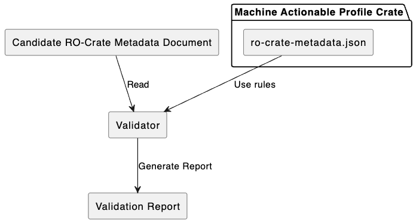

# RO-Crate Machine Actionable Profiles and Schemas (Proof of concept)

## About this repo

This repository is for the development of RO-Crate Profiles and Schemas which implements the requirements set out in [The Notes] for RO-Crate Schemas and Machine Actionable Profiles.

[The Notes]: https://docs.google.com/document/d/17WRkGPIGtoQoSPlTbStBKUyHTzjrOZb620S1gdk0ei8/edit?tab=t.0#heading=h.5vdkev2g6ira 

We have some [Notes](./docs/requirements-coverage.md) on how this solution addresses [The Notes].

This work builds on previous prototyping by PT Sefton under the banner "SoSS+". This work is hosted on a branch on the Language Data Commons [RO-Crate-Schema-tools repo](https://github.com/Language-Research-Technology/ro-crate-schema-tools/tree/sossplus). That branch has a variety of bits of code and prototype schemas and profiles that are in various states of repair.

Now that the work is more advanced, I'm moving it to this repository as a "clean" copy where people will be able to try out working code in a more predictable environment on the main branch.

If this work goes forward then this repository will probably turn into the home of a javascript/Node implementation of an RO-Crate based *RO-Crate Machine Actionable Profiles and Schemas* spec.


## What is here

This repository contains:
- Draft Profiles and Schemas, according to the definitions in [The Notes] which are packaged as RO-Crates, with schema rules included as *Contexual Entites*
- Code (with unit tests) to demonstrate
    - Generating Profile or Schema documentation from a ROC-MAPS crate.
    - Validating candidate RO-Crates against a ROC-MAPS crate (initial implementation is as Unit-tests only)
        - TODO: Command line validator
    - TODO: Generating Editor (Crate-O) configuration from ROC-MAPS crates we have code but it is out of date


## Help wanted!

We would love to see alternative implementations of this proof of concept code. Particularly other approaches to validation -- can ROC-MAPS schemas and classes be transformed into SCHACL? 

## Architecture of the solution

The core of this proposed ROC-MAP solution is to use RO-Crates to package Profiles (or Schemas -- which can be authored in the same way but which would typically be more permissive).

This ROC-MAP Crate can be used in combination with textual summary of the Profile to create documentation with an automatically generated summary of what should be in conformant crates.

<!--
@startuml

package "Machine Actionable Profile Crate" as mapc {
rectangle "ro-crate-metadata.json" as rcd
rectangle "Profile summary document" as psd
}

rectangle "Human-readable text description of profile (profile.txt)" as pt

rectangle "Doc generation script"  as dgs

dgs <-up- rcd : Use rules
dgs <-up- pt : Use text
dgs -up-> psd : Generate Documentation


@enduml
-->


To run this, choose one of the examples from the implementations section below. Eg to generate the documentation for the RO-Crate Workflow profile example, run:

```javascript
npm run build:workflow-profile
```

Or to validate a workflow crate: 
```
npm run validate:workflow
```

To get the full validation report (which is a work in progress):

```
npm run validate:workflow:json
```

NOTE: At the moment these scripts are passing in the profile to validate against. TOTO: In future the code will support fetching or matching local copies of profiles by IRI on a conformsTo property.

Similarly, validators can use a ROC-MAPS crate as a set of rules:

<!--
@startuml

package "Machine Actionable Profile Crate" as mapc {
rectangle "ro-crate-metadata.json" as rcd
}

rectangle "Candidate RO-Crate Metadata Document" as roc

rectangle "Validator"  as dgs

rectangle "Validation Report" as vr

dgs <-up- rcd : Use rules
dgs <-up- roc : Read
dgs -down-> vr : Generate Report


@enduml
-->




## Draft ROC-MAP Implementations

The following RO-Crate Machine Actionable Profiles and Schemas are avaialable to try.

- Workflow Crate Profile
  Generate docs: `npm run build:workflow-profile`
  Run a validator: 

## TODO: (these are all partially implemented in the [SoSS+ Branch] 
- ROC-MAPS for RO-Crate itself
- ROC-MAPS for ROC-MAPS (extensions to the RO-Crate Profile chapeter)
- Language Data Commons Schemas an 


[Soss+ Branch]: https://github.com/Language-Research-Technology/ro-crate-schema-tools/tree/sossplus


## Building Profile and Schema documentation

This repository includes several profiles and schemas that can be built using npm scripts. Each build command generates documentation from the RO-Crate metadata.

### Available Build Commands

- **Workflow Profile**: `npm run build:workflow-profile`

#### COMING SOON!!
- **LDAC Profile**: `npm run build:ldac-profile`
- **RO-Crate Profile**: `npm run build:ro-crate-profile`
- **Generic Collection Profile**: `npm run build:generic-profile`
- **SOA Profile**: `npm run build:soa-profile`
- **Austalk Schema**: `npm run build:austalk-schema`

### Examples

Build a specific profile:
```bash
npm run build:workflow-profile
```

Build all profiles (if you want to build multiple):
```bash
npm run build:ldac-profile && npm run build:ro-crate-profile && npm run build:generic-profile
```

Each build command runs the `generate-soss-docs.js` script with three arguments:
1. Path to the ro-crate-metadata.json file
2. Path to the profile/schema text markdown file
3. Path to the output documentation markdown file


## Validating RO-Crates from the Command Line

You can validate a target RO-Crate against a profile crate using the command-line tool `validate-crate.js`.

### Usage

```bash
node validate-crate.js <target-crate.json> <profile-crate.json>
```

For example, to validate the minimal workflow crate against the workflow profile:

```bash
node validate-crate.js profiles/workflow/examples/minimal-example/ro-crate-metadata.json profiles/workflow/profile-crate/ro-crate-metadata.json
```

The tool will print validation results to the console and exit with a nonzero code if errors are found.
