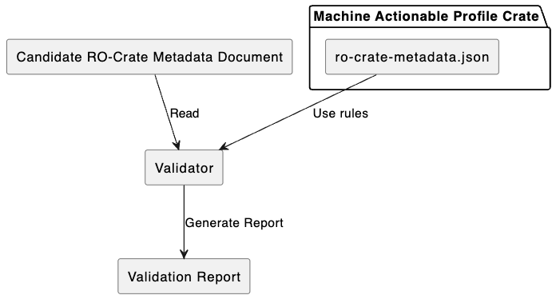

# RO-Crate Machine Actionable Schemas and Profile (Proof of concept)

## About this repo

This repository is for the development of RO-Crate Schemas and Profiles (RO-Crate-MASP) which implements the requirements set out in [The Notes] for RO-Crate Schemas and Machine Actionable Profiles.

[The Notes]: https://docs.google.com/document/d/17WRkGPIGtoQoSPlTbStBKUyHTzjrOZb620S1gdk0ei8/edit?tab=t.0#heading=h.5vdkev2g6ira 

We have some [discussion here](./docs/requirements-coverage.md) on how this solution addresses [The Notes].

This work builds on previous prototyping by PT Sefton under the banner "SoSS+". This work is hosted on a branch on the Language Data Commons [RO-Crate-Schema-Tools repo](https://github.com/Language-Research-Technology/ro-crate-schema-tools/tree/sossplus). That branch has a variety of bits of code and prototype schemas and profiles that are in various states of repair.

Now that the work is more advanced, I'm moving it to this repository as a "clean" copy where people will be able to try out working code in a more predictable environment on the main branch.

If this work goes forward then this repository will probably turn into the home of a javascript/Node implementation of an RO-Crate based *RO-Crate Machine Actionable Profiles and Schemas* spec.

## Published Profiles and Schemas

These are the published GitHub Pages versions of the current profiles and schemas:

  - Profile: RO-Crate MASP Profile: https://language-research-technology.github.io/ro-crate-masp/profiles/ro-crate-masp/profile-crate/index.html
  - Profile: RO-Crate Profile: https://language-research-technology.github.io/ro-crate-masp/profiles/ro-crate/profile-crate/index.html
  - Profile: Workflow Profile: https://language-research-technology.github.io/ro-crate-masp/profiles/workflow/profile-crate/index.html
  - Profile: LDAC Profile: https://language-research-technology.github.io/ro-crate-masp/profiles/ldac/profile-crate/index.html
  - Profile: CCA Demo Profile: https://language-research-technology.github.io/ro-crate-masp/profiles/cca-demo/profile-crate/index.html
  - Schema: Schema.org Schema: https://language-research-technology.github.io/ro-crate-masp/schemas/schema-org/schema-crate/index.html
  - Schema: LDAC Schema: https://language-research-technology.github.io/ro-crate-masp/schemas/ldac/schema-crate/index.html
  - Schema: AusTalk Schema: https://language-research-technology.github.io/ro-crate-masp/schemas/austalk/schema-crate/index.html
  - Schema: Template Schema: https://language-research-technology.github.io/ro-crate-masp/schemas/template/schema-crate/index.html


## What is here

This repository contains:
- Draft Profiles and Schemas, according to the definitions in [The Notes] which are packaged as RO-Crates, with schema rules included as *Contextual Entities*
  - *Start Here*: There is a [draft profile for _RO-Crate Machine Actionable Schemas and Profile_](profiles/ro-crate-masp/profile-crate/profile-documentation.md) which acts as an introduction.
  - We have a complete copy of Schema.org's schema - which imports without change into RO-Crate-MASP -- here's the Schema.org [documentation](https://language-research-technology.github.io/ro-crate-masp/schemas/schema-org/schema-crate/index.html)
- Code (with unit tests) to demonstrate
    - Generating Profile or Schema documentation from a ROC-MASP crate.
    - Validating candidate RO-Crates against a ROC-MASP crate (initial implementation is as Unit-tests only)
        - TODO: Command line validator
    - TODO: Generating Editor (Crate-O) configuration from ROC-MASP crates we have code but it is out of date

### Things to look at

- Port of the [Workflow RO-Crate Profile 1.0](https://about.workflowhub.eu/Workflow-RO-Crate/). [Experimental New Version](./profiles/workflow/profile-crate/profile-documentation.md). The markdown document lists its own provenance like so:
    > This document was compiled using [generate-soss-docs.js](https://github.com/Language-Research-Technology/ro-crate-schema-tools/blob/main/generate-soss-docs.js), based on [profiles/workflow/profile-text.md](https://github.com/Language-Research-Technology/ro-crate-schema-tools/blob/main/profiles/workflow/profile-text.md) using a SoSS+ Schema defined in [profiles/workflow/profile-crate/ro-crate-metadata.json](https://github.com/Language-Research-Technology/ro-crate-schema-tools/blob/main/profiles/workflow/profile-crate/ro-crate-metadata.json).

    See the [Excel version](profiles/workflow/profile-crate/ro-crate-metadata.xlsx) of the Profile rules.

- Profile for the small number of metadata requirements for RO-Crate itself: [Experimental new version](./profiles/ro-crate/profile-crate/profile-documentation.md).
    > This document was compiled using [generate-soss-docs.js](https://github.com/Language-Research-Technology/ro-crate-schema-tools/blob/main/generate-soss-docs.js), based on [profiles/ro-crate/profile-text.md](https://github.com/Language-Research-Technology/ro-crate-schema-tools/blob/main/profiles/ro-crate/profile-text.md) using a SoSS+ Schema defined in [profiles/ro-crate/profile-crate/ro-crate-metadata.json](https://github.com/Language-Research-Technology/ro-crate-schema-tools/blob/main/profiles/ro-crate/profile-crate/ro-crate-metadata.json).


We would love to see alternative implementations of this proof of concept code. Particularly other approaches to validation -- can ROC-MASP schemas and classes be transformed into SHACL? 

## Architecture of the solution

The core of this proposed ROC-MASP solution is to use RO-Crates to package Profiles (or Schemas -- which can be authored in the same way but which would typically be more permissive).

This ROC-MASP Crate can be used in combination with textual summary of the Profile to create documentation with an automatically generated summary of what should be in conformant crates.

<!--
@startuml

package "Machine Actionable Profile Crate" as mapc {
rectangle "ro-crate-metadata.json" as rcd
rectangle "Profile summary document" as psd
}

rectangle "Human-readable text description of profile (profile.txt)" as pt

rectangle "Doc generation script"  as dgs

dgs <-up- rcd : Use rules
dgs <-up- pt : Use text
dgs -up-> psd : Generate Documentation


@enduml
-->


## Running the tests

```bash
npm test                                   # run all tests (~38)
npx mocha test/ldac-validator.test.js      # run a single test file
```

Tests use real profile crates from `profiles/` and sample crates from `test_data/`, so changes to either will affect test results.

## Building documentation

To run this, choose one of the examples from the implementations section below. E.g. to generate the documentation for the RO-Crate Workflow profile example, run:

```javascript
npm run build:workflow-profile
```

Or to validate an example workflow crate: 
```
npm run validate:workflow 
```

To get the full validation report (which is a work in progress):

```
npm run validate:workflow:json
```

NOTE: At the moment these scripts are passing in the profile to validate against. TOTO: In future the code will support fetching or matching local copies of profiles by IRI on a conformsTo property.

Similarly, validators can use a ROC-MASP crate as a set of rules:

<!--
@startuml

package "Machine Actionable Profile Crate" as mapc {
rectangle "ro-crate-metadata.json" as rcd
}

rectangle "Candidate RO-Crate Metadata Document" as roc

rectangle "Validator"  as dgs

rectangle "Validation Report" as vr

dgs <-up- rcd : Use rules
dgs <-up- roc : Read
dgs -down-> vr : Generate Report


@enduml
-->




## Building Profile and Schema documentation

This repository includes several profiles and schemas that can be built using npm scripts. Each build command generates documentation from the RO-Crate metadata.

### Available Build Commands

- **Workflow Profile**: `npm run build:workflow-profile`
- **RO-Crate Profile**: `npm run build:ro-crate-profile`
- **Language Data Commons (LDAC) Profile**: `npm run build:ldac-profile`
- **Language Data Commons (LDAC) Schema**: `npm run build:ldac-schema`
- **AusTalk Schema**: `npm run build:austalk-schema`


### Usage note: rocxl synchronisation

- **Flag**: `-x` or `--rocxl` — when running `generate-masp-docs` for profiles or schemas, you can pass `-x` to run `rocxl` first and ensure `ro-crate-metadata.json` and `ro-crate-metadata.xlsx` are synchronised. The generator will choose the newer of the two files and update the other; if only the spreadsheet exists, the JSON will be created from it. It will then generate documentation from the JSON file as usual.

Example:

```bash
npm exec -- generate-masp-docs -- profiles/ldac/profile-crate/ro-crate-metadata.json profiles/ldac/profile-text.md profiles/ldac/profile-crate/profile-documentation.md -x
```


Each build command runs the `generate-soss-docs.js` script with three arguments:
1. Path to the `ro-crate-metadata.json` file
2. Path to the profile/schema text markdown file
3. Path to the output documentation markdown file


## Validating RO-Crates from the Command Line

You can validate a target RO-Crate against a profile crate or schema using the command-line tool `validate-crate.js`.

### Usage

```bash
node validate-crate.js <target-crate.json> <profile-crate.json>
```

For example, to validate the minimal workflow crate against the workflow profile:

```bash
node validate-crate.js profiles/workflow/examples/minimal-example/ro-crate-metadata.json profiles/workflow/profile-crate/ro-crate-metadata.json
```

The tool will print validation results to the console and exit with a nonzero code if errors are found.


## Help wanted!

We would love to see alternative implementations of this proof of concept code. Particularly other approaches to validation -- can ROC-MASP schemas and classes be transformed into SCHACL? 
