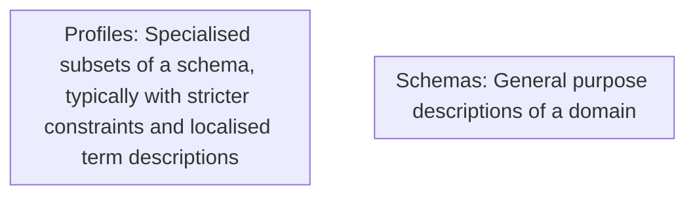
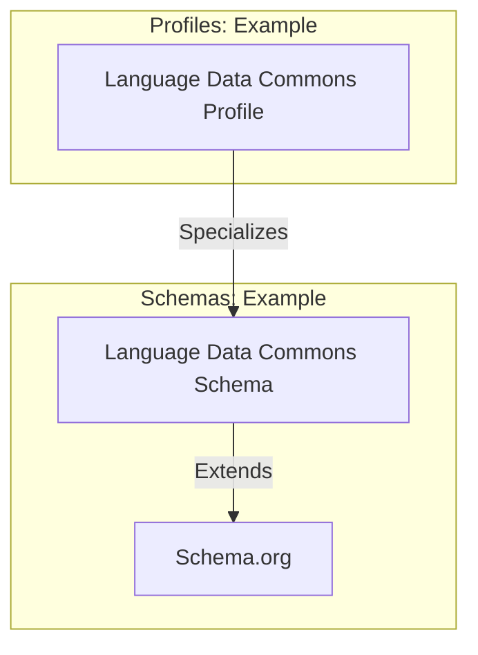
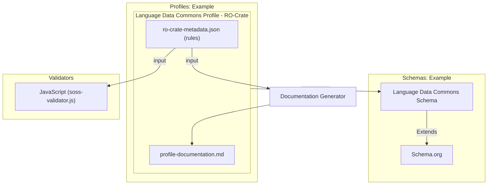

# RO-Crate Machine Actionable Schemas and Profiles (MASP)

This profile describes the structure of an RO-Crate MASP **Profile Crate** — a crate that contains machine-readable validation rules for other RO-Crates. It is used both as documentation and as input to the MASP validator and documentation generator. This profile is self-describing: the MASP profile crate is itself a valid instance of this profile.

## Background

### Definitions

| Term | Definition |
|------|------------|
| **General Purpose Schema** | A specification of Classes and Properties intended for use across multiple profiles (e.g. Schema.org, Dublin Core, Darwin Core). These may have loose range/domain constraints, typically with inheritance (a `Person` is a subclass of `Thing`). |
| **Schema Language** | The formalisation used to express a schema. Examples include RDF Schema (RDFS), OWL, SKOS, and Schema.org's own data model. |
| **SoSS (Schema.org Style Schema)** | Schema.org's data model expressed as a set of `rdfs:Class` and `rdf:Property` definitions in JSON-LD. RO-Crate 1.2 uses this approach for adding extra vocabulary terms to crates and profiles. |
| **Profile Specific Schema** | A schema specialised for a particular domain. For example, the Language Data Commons has a general-purpose SoSS at `http://w3id.org/ldac/terms` and a stricter profile at `https://w3id.org/ldac/profile`. |
| **Class** | A named type applied to entities via the `@type` property. MASP uses `rdfs:Class` as per Schema.org's data model. |
| **Property** | An attribute of an entity. MASP uses `rdf:Property` as per Schema.org's data model. |
| **Profile** | A specialisation of a standard or specification, as defined by the W3C Profiles Vocabulary. A profile introduces constraints or extensions that make a standard suitable for a particular purpose. Profile Crates are profiles of RO-Crate. |
| **Profile Crate** | An RO-Crate whose root entity has `@type: ["Dataset", "Profile"]` and contains machine-readable schema rules alongside human-readable documentation. |

The relationship between schemas and profiles:



An example with real vocabularies:



Both schemas and profiles can be expressed in RO-Crate MASP:



### Background: Schema.org Style Schemas

Schema.org describes its vocabulary using `rdf:Property` and `rdfs:Class` entities. RO-Crate has used this convention since its inception. For example, the Schema.org definition of `author`:

```json
{
  "@id": "schema:author",
  "@type": "rdf:Property",
  "rdfs:comment": "The author of this content.",
  "rdfs:label": "author",
  "schema:domainIncludes": [
    {"@id": "schema:CreativeWork"}
  ],
  "schema:rangeIncludes": [
    {"@id": "schema:Organization"},
    {"@id": "schema:Person"}
  ]
}
```

MASP extends this approach with a few additions — `prov:specializationOf` to link a profile-specific class or property to its base vocabulary term, and `sh:minCount`/`sh:maxCount` borrowed from SHACL to express cardinality.

## Profile Specific Schemas

A MASP profile-specific schema specialises Schema.org-style terms for a particular context. The key differences from plain Schema.org style:

- `prov:specializationOf` links the local rule to the base vocabulary term it constrains
- `domainIncludes` (without `schema:` prefix — the validator resolves this via the RO-Crate JSON-LD context) links a property rule to its class rule
- `sh:minCount` and `sh:maxCount` express how many times a property must appear

Example class and property rules for a hypothetical scholarly profile:

```json
{
  "@id": "#class_ScholarlyArticle",
  "@type": "rdfs:Class",
  "prov:specializationOf": {"@id": "https://schema.org/ScholarlyArticle"},
  "rdfs:label": "ScholarlyArticle",
  "rdfs:comment": "A scholarly article in this profile's context.",
  "sh:minCount": 1,
  "sh:maxCount": 1
},
{
  "@id": "#prop_author_ScholarlyArticle",
  "@type": "rdf:Property",
  "prov:specializationOf": {"@id": "https://schema.org/author"},
  "rdfs:label": "author",
  "rdfs:comment": "The author(s) of this scholarly article.",
  "domainIncludes": {"@id": "#class_ScholarlyArticle"},
  "rangeIncludes": {"@id": "#class_Person"},
  "sh:minCount": 1
}
```

**Important**: use `domainIncludes` (not `schema:domainIncludes`) — the validator resolves property names through the RO-Crate JSON-LD context, where the `schema:` prefix is not defined by default.

### Linking the Metadata Descriptor

Every MASP profile must define how to find the root class rule. This is done via a special property rule whose `rdfs:label` is `"@id"` and whose `value` is `"ro-crate-metadata.json"`. The validator detects this pattern to identify which class rule is the Metadata Descriptor — and from there, follows `about` to find the Root Data Entity class:

```json
{
  "@id": "#class_MetadataDescriptor",
  "@type": "rdfs:Class",
  "prov:specializationOf": {"@id": "http://schema.org/CreativeWork"},
  "sh:minCount": 1,
  "sh:maxCount": 1
},
{
  "@id": "#prop_id_MetadataDescriptor",
  "@type": "rdf:Property",
  "rdfs:label": "@id",
  "value": "ro-crate-metadata.json",
  "domainIncludes": {"@id": "#class_MetadataDescriptor"},
  "sh:minCount": 1,
  "sh:maxCount": 1
},
{
  "@id": "#prop_about_MetadataDescriptor",
  "@type": "rdf:Property",
  "prov:specializationOf": {"@id": "http://schema.org/about"},
  "rdfs:label": "about",
  "domainIncludes": {"@id": "#class_MetadataDescriptor"},
  "rangeIncludes": {"@id": "#class_RootDataEntity"},
  "sh:minCount": 1,
  "sh:maxCount": 1
}
```

The validator uses the `#prop_id_MetadataDescriptor` pattern (`rdfs:label: "@id"` + `value: "ro-crate-metadata.json"`) to locate the root class rule at parse time.

### How the Validator Finds Schema Rules

The validator locates schema rules by inspecting the profile's `hasResource` array for a `ResourceDescriptor` entity with `hasRole` pointing to `http://www.w3.org/ns/dx/prof/role/schema`. The `hasPart` array of that descriptor lists all the schema entities (`rdfs:Class`, `rdf:Property`, `ItemList`, `DefinedTermSet`):

```json
{
  "@id": "#hasSpecializedSchema",
  "@type": "ResourceDescriptor",
  "hasRole": {"@id": "http://www.w3.org/ns/dx/prof/role/schema"},
  "hasPart": [
    {"@id": "#class_MetadataDescriptor"},
    {"@id": "#prop_id_MetadataDescriptor"},
    {"@id": "#prop_about_MetadataDescriptor"},
    ...
  ]
}
```

Only entities listed here are treated as validation rules. Other entities in the crate (documentation files, authors, etc.) are ignored by the validator.

## Validation Algorithm

The validator (`soss-validator.js`) works as follows:

1. **Find the schema ResourceDescriptor** — locate the `ResourceDescriptor` with `role/schema` in `hasResource` and read its `hasPart` list.

2. **Parse rules** — for each entity in `hasPart`:
   - `rdfs:Class` → `ClassRule` (type matching + cardinality)
   - `rdf:Property` → `PropertyRule` (presence, cardinality, range, fixed value)
   - `ItemList` → `ItemListRule` (enumerated allowed values)
   - `DefinedTermSet` → `TermRule` (term documentation; currently pass-through)

3. **Detect root class rule** — the property rule with `rdfs:label: "@id"` and `value: "ro-crate-metadata.json"` identifies the Metadata Descriptor class rule. This sets the starting point for validation.

4. **Validate the target crate** — for each class rule, iterate all entities in the target crate:
   - Resolve the entity's `@type` values through the target crate's JSON-LD context
   - Compare against the class rule's `prov:specializationOf` resolved types
   - If the types match, validate all property rules linked to that class via `domainIncludes`
   - Count valid instances and check against `sh:minCount`/`sh:maxCount`

5. **Property rule validation** — for each matching entity:
   - If the property has a `value` constraint, check for exact match
   - Otherwise check cardinality (`sh:minCount`, `sh:maxCount`)
   - If `rangeIncludes` is set, validate each value: primitive types (Text, Number, Boolean, Date) are checked by JS type; entity references are looked up in the crate and validated recursively against the referenced class rule; `ItemList` values are checked against the list's `itemListElement` entries

6. **Results** — the validator returns `{ error, success, rules }` where `rules` contains per-entity property success/error details keyed by rule ID and entity ID.

### Cardinality on Classes vs Properties

`sh:minCount`/`sh:maxCount` mean different things depending on where they appear:

| Location | Meaning |
|----------|---------|
| On an `rdfs:Class` entity | How many instances of this type must exist in the whole crate |
| On an `rdf:Property` entity | How many values this property must/may have on each matching entity |

### Fixed-Value Properties

A property rule with a `value` field asserts that the property must have exactly that value. This is most commonly used for the metadata descriptor's `@id`, which must always be `"ro-crate-metadata.json"`. It is also used for entities like fixed dataset directory identifiers (e.g. `"@id": "examples/"`).

### ItemList Validation

When a property's `rangeIncludes` references an `ItemList` entity, the value must match one of the `itemListElement` entries by `@id`. Item elements can include additional properties that must also match, allowing for constrained contextual entity definitions within a profile.

## Types of entities (specializations of Classes) and expected Properties


### <a id="class_MetadataDescriptor"></a> Class: RO-Crate Metadata Descriptor

The ro-crate-metadata.json file entity that describes the profile crate.

At least 1 instances of this type MUST be present in the crate.

 A maximum of 1 instances of this type  MAY be present in the crate.

| Min Count | Max Count |
| --------- | --------- |
| 1 | 1 |

| Property | Required | Description | Range | Value |
| -------- | -------- | ----------- | ----- | ----- |
| @type | Yes |  |  | http://schema.org/CreativeWork |
| <a href="#prop_id_MetadataDescriptor">@id</a> | Yes |  | Text | ro-crate-metadata.json |
| <a href="#prop_about_MetadataDescriptor">about <a href="#prop_about_MetadataDescriptor" target="_blank" rel="noopener">ⓘ</a></a> | Yes | MUST reference the root profile Dataset entity. | <a href="#class_ProfileDataset">Profile Dataset</a> |  |
| <a href="#prop_conformsTo_MetadataDescriptor">conformsTo <a href="#prop_conformsTo_MetadataDescriptor" target="_blank" rel="noopener">ⓘ</a></a> | Yes | MUST reference the RO-Crate specification the crate conforms to. | <a href="#class_CreativeWork">CreativeWork</a> |  |


### <a id="class_ProfileDataset"></a> Class: Profile Dataset

The root entity of a MASP profile crate. Must have @type [Dataset, Profile].

At least 1 instances of this type MUST be present in the crate.

 A maximum of 1 instances of this type  MAY be present in the crate.

| Min Count | Max Count |
| --------- | --------- |
| 1 | 1 |

| Property | Required | Description | Range | Value |
| -------- | -------- | ----------- | ----- | ----- |
| @type | Yes |  |  | http://schema.org/Dataset, http://www.w3.org/ns/dx/prof/Profile |
| <a href="#prop_hasResource_ProfileDataset">hasResource <a href="#prop_hasResource_ProfileDataset" target="_blank" rel="noopener">ⓘ</a></a> | Yes | Links to ResourceDescriptor entities that describe the profile's resources. MUST include at least one descriptor with role/specification. | <a href="#class_ResourceDescriptor">ResourceDescriptor</a> |  |
| <a href="#prop_isProfileOf_ProfileDataset">isProfileOf <a href="#prop_isProfileOf_ProfileDataset" target="_blank" rel="noopener">ⓘ</a></a> | Yes | MUST reference the base RO-Crate specification this profile extends. | <a href="#class_CreativeWork">CreativeWork</a> |  |
| <a href="#prop_license_ProfileDataset">license <a href="#prop_license_ProfileDataset" target="_blank" rel="noopener">ⓘ</a></a> | Yes | License for this profile. | <a href="#class_CreativeWork">CreativeWork</a>, Text |  |
| <a href="#prop_name_ProfileDataset">name <a href="#prop_name_ProfileDataset" target="_blank" rel="noopener">ⓘ</a></a> | Yes | A human-readable name for the profile. | Text |  |
| <a href="#prop_author_ProfileDataset">author <a href="#prop_author_ProfileDataset" target="_blank" rel="noopener">ⓘ</a></a> | No | The person or organization responsible for creating this profile. | <a href="#class_Person">Person</a>, <a href="#class_Organization">Organization</a> |  |
| <a href="#prop_description_ProfileDataset">description <a href="#prop_description_ProfileDataset" target="_blank" rel="noopener">ⓘ</a></a> | No | A description of the profile and its intended use. | Text |  |
| <a href="#prop_hasPart_ProfileDataset">hasPart <a href="#prop_hasPart_ProfileDataset" target="_blank" rel="noopener">ⓘ</a></a> | No | Files that are part of this profile crate. | <a href="#class_File">File</a> |  |
| <a href="#prop_version_ProfileDataset">version <a href="#prop_version_ProfileDataset" target="_blank" rel="noopener">ⓘ</a></a> | No | The version of this profile using semantic versioning (MAJOR.MINOR.PATCH). | Text |  |


### <a id="class_ResourceDescriptor"></a> Class: ResourceDescriptor

Describes a resource that is part of a profile, using the W3C Profiles Vocabulary.

Instances of this type MAY be present in the crate.

| Min Count | Max Count |
| --------- | --------- |
| N/A | N/A |

| Property | Required | Description | Range | Value |
| -------- | -------- | ----------- | ----- | ----- |
| @type | Yes |  |  | http://www.w3.org/ns/dx/prof/ResourceDescriptor |
| <a href="#prop_hasRole_ResourceDescriptor">hasRole <a href="#prop_hasRole_ResourceDescriptor" target="_blank" rel="noopener">ⓘ</a></a> | Yes | The role of this resource within the profile (e.g. role/specification, role/schema, role/guidance). Value is a URI from the W3C PROF vocabulary. |  |  |
| <a href="#prop_hasArtifact_ResourceDescriptor">hasArtifact <a href="#prop_hasArtifact_ResourceDescriptor" target="_blank" rel="noopener">ⓘ</a></a> | No | The file or URL that is the artifact for this resource descriptor. | <a href="#class_File">File</a> |  |
| <a href="#prop_hasPart_ResourceDescriptor">hasPart <a href="#prop_hasPart_ResourceDescriptor" target="_blank" rel="noopener">ⓘ</a></a> | No | For schema ResourceDescriptors: the individual schema entities (classes, properties, item lists) that make up the schema. |  |  |


### <a id="class_rdfsClass"></a> Class: rdfs:Class

A class definition in a MASP schema. Defines a type of entity and its cardinality constraints.

Instances of this type MAY be present in the crate.

| Min Count | Max Count |
| --------- | --------- |
| N/A | N/A |

| Property | Required | Description | Range | Value |
| -------- | -------- | ----------- | ----- | ----- |
| @type | Yes |  |  | http://www.w3.org/2000/01/rdf-schema#Class |
| <a href="#prop_specializationOf_rdfsClass">prov:specializationOf <a href="#prop_specializationOf_rdfsClass" target="_blank" rel="noopener">ⓘ</a></a> | No | The base schema.org (or other vocabulary) type this class specializes. Value is a URI reference; range validation is intentionally omitted as these are external vocab URIs. |  |  |
| <a href="#prop_label_rdfsClass">rdfs:label <a href="#prop_label_rdfsClass" target="_blank" rel="noopener">ⓘ</a></a> | No | An optional rdfs:label for the class. In practice, class entities typically use 'name' as their human-readable label. | Text |  |
| <a href="#prop_maxCount_rdfsClass">sh:maxCount <a href="#prop_maxCount_rdfsClass" target="_blank" rel="noopener">ⓘ</a></a> | No | Maximum number of instances of this class allowed in a conforming crate. | Integer |  |
| <a href="#prop_minCount_rdfsClass">sh:minCount <a href="#prop_minCount_rdfsClass" target="_blank" rel="noopener">ⓘ</a></a> | No | Minimum number of instances of this class that MUST appear in a conforming crate. | Integer |  |


### <a id="class_rdfProperty"></a> Class: rdf:Property

A property definition in a MASP schema. Defines a property, its domain class, range, and cardinality constraints.

Instances of this type MAY be present in the crate.

| Min Count | Max Count |
| --------- | --------- |
| N/A | N/A |

| Property | Required | Description | Range | Value |
| -------- | -------- | ----------- | ----- | ----- |
| @type | Yes |  |  | http://www.w3.org/1999/02/22-rdf-syntax-ns#Property |
| <a href="#prop_domainIncludes_rdfProperty">domainIncludes <a href="#prop_domainIncludes_rdfProperty" target="_blank" rel="noopener">ⓘ</a></a> | Yes | The class(es) that this property applies to. | <a href="#class_rdfsClass">rdfs:Class</a> |  |
| <a href="#prop_label_rdfProperty">rdfs:label <a href="#prop_label_rdfProperty" target="_blank" rel="noopener">ⓘ</a></a> | Yes | A human-readable label for the property, usually matching the property name. | Text |  |
| <a href="#prop_specializationOf_rdfProperty">prov:specializationOf <a href="#prop_specializationOf_rdfProperty" target="_blank" rel="noopener">ⓘ</a></a> | No | The base vocabulary property this property specializes. Value is an external URI reference; range validation intentionally omitted. |  |  |
| <a href="#prop_rangeIncludes_rdfProperty">rangeIncludes <a href="#prop_rangeIncludes_rdfProperty" target="_blank" rel="noopener">ⓘ</a></a> | No | The expected value type(s) for this property. Range validation is intentionally omitted because these reference external schema types (Text, URL, Integer, etc.) that are not entities in the crate. |  |  |
| <a href="#prop_maxCount_rdfProperty">sh:maxCount <a href="#prop_maxCount_rdfProperty" target="_blank" rel="noopener">ⓘ</a></a> | No | Maximum number of times this property MAY appear on entities of the domain class. | Integer |  |
| <a href="#prop_minCount_rdfProperty">sh:minCount <a href="#prop_minCount_rdfProperty" target="_blank" rel="noopener">ⓘ</a></a> | No | Minimum number of times this property MUST appear on entities of the domain class. | Integer |  |
| <a href="#prop_value_rdfProperty">value <a href="#prop_value_rdfProperty" target="_blank" rel="noopener">ⓘ</a></a> | No | A fixed value that this property MUST have on conforming entities. | Text |  |


### <a id="class_ItemList"></a> Class: ItemList

A list of allowed values for a property. When a property's rangeIncludes is an ItemList, values MUST be drawn from the list.

Instances of this type MAY be present in the crate.

| Min Count | Max Count |
| --------- | --------- |
| N/A | N/A |

| Property | Required | Description | Range | Value |
| -------- | -------- | ----------- | ----- | ----- |
| @type | Yes |  |  | http://schema.org/ItemList |
| <a href="#prop_itemListElement_ItemList">itemListElement <a href="#prop_itemListElement_ItemList" target="_blank" rel="noopener">ⓘ</a></a> | Yes | The items in this list. Each item is an entity whose @id is an allowed value. |  |  |


### <a id="class_DefinedTermSet"></a> Class: DefinedTermSet

A set of defined vocabulary terms.

Instances of this type MAY be present in the crate.

| Min Count | Max Count |
| --------- | --------- |
| N/A | N/A |

| Property | Required | Description | Range | Value |
| -------- | -------- | ----------- | ----- | ----- |
| @type | Yes |  |  | http://schema.org/DefinedTermSet |
| <a href="#prop_name_DefinedTermSet">name <a href="#prop_name_DefinedTermSet" target="_blank" rel="noopener">ⓘ</a></a> | Yes | The name of this term set. | Text |  |


### <a id="class_DefinedTerm"></a> Class: DefinedTerm

A single vocabulary term within a DefinedTermSet.

Instances of this type MAY be present in the crate.

| Min Count | Max Count |
| --------- | --------- |
| N/A | N/A |

| Property | Required | Description | Range | Value |
| -------- | -------- | ----------- | ----- | ----- |
| @type | Yes |  |  | http://schema.org/DefinedTerm |
| <a href="#prop_inDefinedTermSet_DefinedTerm">inDefinedTermSet <a href="#prop_inDefinedTermSet_DefinedTerm" target="_blank" rel="noopener">ⓘ</a></a> | Yes | The DefinedTermSet this term belongs to. | <a href="#class_DefinedTermSet">DefinedTermSet</a> |  |
| <a href="#prop_name_DefinedTerm">name <a href="#prop_name_DefinedTerm" target="_blank" rel="noopener">ⓘ</a></a> | Yes | The name of this term. | Text |  |


### <a id="class_Person"></a> Class: Person

A person, used as an author or contributor.

Instances of this type MAY be present in the crate.

| Min Count | Max Count |
| --------- | --------- |
| N/A | N/A |

| Property | Required | Description | Range | Value |
| -------- | -------- | ----------- | ----- | ----- |
| @type | Yes |  |  | http://schema.org/Person |
*No properties defined for this class*


### <a id="class_Organization"></a> Class: Organization

An organization, used as an author, publisher, or contributor.

Instances of this type MAY be present in the crate.

| Min Count | Max Count |
| --------- | --------- |
| N/A | N/A |

| Property | Required | Description | Range | Value |
| -------- | -------- | ----------- | ----- | ----- |
| @type | Yes |  |  | http://schema.org/Organization |
*No properties defined for this class*


### <a id="class_File"></a> Class: File

A file that is part of a profile crate.

Instances of this type MAY be present in the crate.

| Min Count | Max Count |
| --------- | --------- |
| N/A | N/A |

| Property | Required | Description | Range | Value |
| -------- | -------- | ----------- | ----- | ----- |
| @type | Yes |  |  | http://schema.org/MediaObject |
*No properties defined for this class*


### <a id="class_CreativeWork"></a> Class: CreativeWork

A creative work, used for licenses and specification references.

Instances of this type MAY be present in the crate.

| Min Count | Max Count |
| --------- | --------- |
| N/A | N/A |

| Property | Required | Description | Range | Value |
| -------- | -------- | ----------- | ----- | ----- |
| @type | Yes |  |  | http://schema.org/CreativeWork |
*No properties defined for this class*


### <a id="class_ResourceRole"></a> Class: ResourceRole

A role URI from the W3C Profiles Vocabulary (http://www.w3.org/ns/dx/prof/role/).

Instances of this type MAY be present in the crate.

| Min Count | Max Count |
| --------- | --------- |
| N/A | N/A |

| Property | Required | Description | Range | Value |
| -------- | -------- | ----------- | ----- | ----- |
| @type | Yes |  |  | http://www.w3.org/ns/dx/prof/ResourceRole |
*No properties defined for this class*


## All Properties

### <a id="prop_id_MetadataDescriptor"></a> Property: @id

ID: #prop_id_MetadataDescriptor

| Description | Range | Occurs in Domain(s) |
| ----------- | ----------- | ----------- |
|  | Text | <a href="#class_MetadataDescriptor">RO-Crate Metadata Descriptor</a> |
### <a id="prop_about_MetadataDescriptor"></a> Property: about <a href="http://schema.org/about" target="_blank" rel="noopener">ⓘ</a>

ID: #prop_about_MetadataDescriptor

| Description | Range | Occurs in Domain(s) |
| ----------- | ----------- | ----------- |
| MUST reference the root profile Dataset entity. | <a href="#class_ProfileDataset">Profile Dataset</a> | <a href="#class_MetadataDescriptor">RO-Crate Metadata Descriptor</a> |
### <a id="prop_author_ProfileDataset"></a> Property: author <a href="http://schema.org/author" target="_blank" rel="noopener">ⓘ</a>

ID: #prop_author_ProfileDataset

| Description | Range | Occurs in Domain(s) |
| ----------- | ----------- | ----------- |
| The person or organization responsible for creating this profile. | <a href="#class_Person">Person</a>, <a href="#class_Organization">Organization</a> | <a href="#class_ProfileDataset">Profile Dataset</a> |
### <a id="prop_conformsTo_MetadataDescriptor"></a> Property: conformsTo <a href="http://schema.org/conformsTo" target="_blank" rel="noopener">ⓘ</a>

ID: #prop_conformsTo_MetadataDescriptor

| Description | Range | Occurs in Domain(s) |
| ----------- | ----------- | ----------- |
| MUST reference the RO-Crate specification the crate conforms to. | <a href="#class_CreativeWork">CreativeWork</a> | <a href="#class_MetadataDescriptor">RO-Crate Metadata Descriptor</a> |
### <a id="prop_description_ProfileDataset"></a> Property: description <a href="http://schema.org/description" target="_blank" rel="noopener">ⓘ</a>

ID: #prop_description_ProfileDataset

| Description | Range | Occurs in Domain(s) |
| ----------- | ----------- | ----------- |
| A description of the profile and its intended use. | Text | <a href="#class_ProfileDataset">Profile Dataset</a> |
### <a id="prop_domainIncludes_rdfProperty"></a> Property: domainIncludes <a href="http://schema.org/domainIncludes" target="_blank" rel="noopener">ⓘ</a>

ID: #prop_domainIncludes_rdfProperty

| Description | Range | Occurs in Domain(s) |
| ----------- | ----------- | ----------- |
| The class(es) that this property applies to. | <a href="#class_rdfsClass">rdfs:Class</a> | <a href="#class_rdfProperty">rdf:Property</a> |
### <a id="prop_hasArtifact_ResourceDescriptor"></a> Property: hasArtifact <a href="http://www.w3.org/ns/dx/prof/hasArtifact" target="_blank" rel="noopener">ⓘ</a>

ID: #prop_hasArtifact_ResourceDescriptor

| Description | Range | Occurs in Domain(s) |
| ----------- | ----------- | ----------- |
| The file or URL that is the artifact for this resource descriptor. | <a href="#class_File">File</a> | <a href="#class_ResourceDescriptor">ResourceDescriptor</a> |
### <a id="prop_hasPart_ProfileDataset"></a> Property: hasPart <a href="http://schema.org/hasPart" target="_blank" rel="noopener">ⓘ</a>

ID: #prop_hasPart_ProfileDataset

| Description | Range | Occurs in Domain(s) |
| ----------- | ----------- | ----------- |
| Files that are part of this profile crate. | <a href="#class_File">File</a> | <a href="#class_ProfileDataset">Profile Dataset</a> |
### <a id="prop_hasPart_ResourceDescriptor"></a> Property: hasPart <a href="http://schema.org/hasPart" target="_blank" rel="noopener">ⓘ</a>

ID: #prop_hasPart_ResourceDescriptor

| Description | Range | Occurs in Domain(s) |
| ----------- | ----------- | ----------- |
| For schema ResourceDescriptors: the individual schema entities (classes, properties, item lists) that make up the schema. |  | <a href="#class_ResourceDescriptor">ResourceDescriptor</a> |
### <a id="prop_hasResource_ProfileDataset"></a> Property: hasResource <a href="http://www.w3.org/ns/dx/prof/hasResource" target="_blank" rel="noopener">ⓘ</a>

ID: #prop_hasResource_ProfileDataset

| Description | Range | Occurs in Domain(s) |
| ----------- | ----------- | ----------- |
| Links to ResourceDescriptor entities that describe the profile's resources. MUST include at least one descriptor with role/specification. | <a href="#class_ResourceDescriptor">ResourceDescriptor</a> | <a href="#class_ProfileDataset">Profile Dataset</a> |
### <a id="prop_hasRole_ResourceDescriptor"></a> Property: hasRole <a href="http://www.w3.org/ns/dx/prof/hasRole" target="_blank" rel="noopener">ⓘ</a>

ID: #prop_hasRole_ResourceDescriptor

| Description | Range | Occurs in Domain(s) |
| ----------- | ----------- | ----------- |
| The role of this resource within the profile (e.g. role/specification, role/schema, role/guidance). Value is a URI from the W3C PROF vocabulary. |  | <a href="#class_ResourceDescriptor">ResourceDescriptor</a> |
### <a id="prop_inDefinedTermSet_DefinedTerm"></a> Property: inDefinedTermSet <a href="http://schema.org/inDefinedTermSet" target="_blank" rel="noopener">ⓘ</a>

ID: #prop_inDefinedTermSet_DefinedTerm

| Description | Range | Occurs in Domain(s) |
| ----------- | ----------- | ----------- |
| The DefinedTermSet this term belongs to. | <a href="#class_DefinedTermSet">DefinedTermSet</a> | <a href="#class_DefinedTerm">DefinedTerm</a> |
### <a id="prop_isProfileOf_ProfileDataset"></a> Property: isProfileOf <a href="http://schema.org/isProfileOf" target="_blank" rel="noopener">ⓘ</a>

ID: #prop_isProfileOf_ProfileDataset

| Description | Range | Occurs in Domain(s) |
| ----------- | ----------- | ----------- |
| MUST reference the base RO-Crate specification this profile extends. | <a href="#class_CreativeWork">CreativeWork</a> | <a href="#class_ProfileDataset">Profile Dataset</a> |
### <a id="prop_itemListElement_ItemList"></a> Property: itemListElement <a href="http://schema.org/itemListElement" target="_blank" rel="noopener">ⓘ</a>

ID: #prop_itemListElement_ItemList

| Description | Range | Occurs in Domain(s) |
| ----------- | ----------- | ----------- |
| The items in this list. Each item is an entity whose @id is an allowed value. |  | <a href="#class_ItemList">ItemList</a> |
### <a id="prop_license_ProfileDataset"></a> Property: license <a href="http://schema.org/license" target="_blank" rel="noopener">ⓘ</a>

ID: #prop_license_ProfileDataset

| Description | Range | Occurs in Domain(s) |
| ----------- | ----------- | ----------- |
| License for this profile. | <a href="#class_CreativeWork">CreativeWork</a>, Text | <a href="#class_ProfileDataset">Profile Dataset</a> |
### <a id="prop_name_ProfileDataset"></a> Property: name <a href="http://schema.org/name" target="_blank" rel="noopener">ⓘ</a>

ID: #prop_name_ProfileDataset

| Description | Range | Occurs in Domain(s) |
| ----------- | ----------- | ----------- |
| A human-readable name for the profile. | Text | <a href="#class_ProfileDataset">Profile Dataset</a> |
### <a id="prop_name_DefinedTermSet"></a> Property: name <a href="http://schema.org/name" target="_blank" rel="noopener">ⓘ</a>

ID: #prop_name_DefinedTermSet

| Description | Range | Occurs in Domain(s) |
| ----------- | ----------- | ----------- |
| The name of this term set. | Text | <a href="#class_DefinedTermSet">DefinedTermSet</a> |
### <a id="prop_name_DefinedTerm"></a> Property: name <a href="http://schema.org/name" target="_blank" rel="noopener">ⓘ</a>

ID: #prop_name_DefinedTerm

| Description | Range | Occurs in Domain(s) |
| ----------- | ----------- | ----------- |
| The name of this term. | Text | <a href="#class_DefinedTerm">DefinedTerm</a> |
### <a id="prop_specializationOf_rdfsClass"></a> Property: prov:specializationOf <a href="http://www.w3.org/ns/prov#specializationOf" target="_blank" rel="noopener">ⓘ</a>

ID: #prop_specializationOf_rdfsClass

| Description | Range | Occurs in Domain(s) |
| ----------- | ----------- | ----------- |
| The base schema.org (or other vocabulary) type this class specializes. Value is a URI reference; range validation is intentionally omitted as these are external vocab URIs. |  | <a href="#class_rdfsClass">rdfs:Class</a> |
### <a id="prop_specializationOf_rdfProperty"></a> Property: prov:specializationOf <a href="http://www.w3.org/ns/prov#specializationOf" target="_blank" rel="noopener">ⓘ</a>

ID: #prop_specializationOf_rdfProperty

| Description | Range | Occurs in Domain(s) |
| ----------- | ----------- | ----------- |
| The base vocabulary property this property specializes. Value is an external URI reference; range validation intentionally omitted. |  | <a href="#class_rdfProperty">rdf:Property</a> |
### <a id="prop_rangeIncludes_rdfProperty"></a> Property: rangeIncludes <a href="http://schema.org/rangeIncludes" target="_blank" rel="noopener">ⓘ</a>

ID: #prop_rangeIncludes_rdfProperty

| Description | Range | Occurs in Domain(s) |
| ----------- | ----------- | ----------- |
| The expected value type(s) for this property. Range validation is intentionally omitted because these reference external schema types (Text, URL, Integer, etc.) that are not entities in the crate. |  | <a href="#class_rdfProperty">rdf:Property</a> |
### <a id="prop_label_rdfsClass"></a> Property: rdfs:label <a href="http://www.w3.org/2000/01/rdf-schema#label" target="_blank" rel="noopener">ⓘ</a>

ID: #prop_label_rdfsClass

| Description | Range | Occurs in Domain(s) |
| ----------- | ----------- | ----------- |
| An optional rdfs:label for the class. In practice, class entities typically use 'name' as their human-readable label. | Text | <a href="#class_rdfsClass">rdfs:Class</a> |
### <a id="prop_label_rdfProperty"></a> Property: rdfs:label <a href="http://www.w3.org/2000/01/rdf-schema#label" target="_blank" rel="noopener">ⓘ</a>

ID: #prop_label_rdfProperty

| Description | Range | Occurs in Domain(s) |
| ----------- | ----------- | ----------- |
| A human-readable label for the property, usually matching the property name. | Text | <a href="#class_rdfProperty">rdf:Property</a> |
### <a id="prop_maxCount_rdfsClass"></a> Property: sh:maxCount <a href="http://www.w3.org/ns/shacl#maxCount" target="_blank" rel="noopener">ⓘ</a>

ID: #prop_maxCount_rdfsClass

| Description | Range | Occurs in Domain(s) |
| ----------- | ----------- | ----------- |
| Maximum number of instances of this class allowed in a conforming crate. | Integer | <a href="#class_rdfsClass">rdfs:Class</a> |
### <a id="prop_maxCount_rdfProperty"></a> Property: sh:maxCount <a href="http://www.w3.org/ns/shacl#maxCount" target="_blank" rel="noopener">ⓘ</a>

ID: #prop_maxCount_rdfProperty

| Description | Range | Occurs in Domain(s) |
| ----------- | ----------- | ----------- |
| Maximum number of times this property MAY appear on entities of the domain class. | Integer | <a href="#class_rdfProperty">rdf:Property</a> |
### <a id="prop_minCount_rdfsClass"></a> Property: sh:minCount <a href="http://www.w3.org/ns/shacl#minCount" target="_blank" rel="noopener">ⓘ</a>

ID: #prop_minCount_rdfsClass

| Description | Range | Occurs in Domain(s) |
| ----------- | ----------- | ----------- |
| Minimum number of instances of this class that MUST appear in a conforming crate. | Integer | <a href="#class_rdfsClass">rdfs:Class</a> |
### <a id="prop_minCount_rdfProperty"></a> Property: sh:minCount <a href="http://www.w3.org/ns/shacl#minCount" target="_blank" rel="noopener">ⓘ</a>

ID: #prop_minCount_rdfProperty

| Description | Range | Occurs in Domain(s) |
| ----------- | ----------- | ----------- |
| Minimum number of times this property MUST appear on entities of the domain class. | Integer | <a href="#class_rdfProperty">rdf:Property</a> |
### <a id="prop_value_rdfProperty"></a> Property: value <a href="http://schema.org/value" target="_blank" rel="noopener">ⓘ</a>

ID: #prop_value_rdfProperty

| Description | Range | Occurs in Domain(s) |
| ----------- | ----------- | ----------- |
| A fixed value that this property MUST have on conforming entities. | Text | <a href="#class_rdfProperty">rdf:Property</a> |
### <a id="prop_version_ProfileDataset"></a> Property: version <a href="http://schema.org/version" target="_blank" rel="noopener">ⓘ</a>

ID: #prop_version_ProfileDataset

| Description | Range | Occurs in Domain(s) |
| ----------- | ----------- | ----------- |
| The version of this profile using semantic versioning (MAJOR.MINOR.PATCH). | Text | <a href="#class_ProfileDataset">Profile Dataset</a> |


## Item Lists


