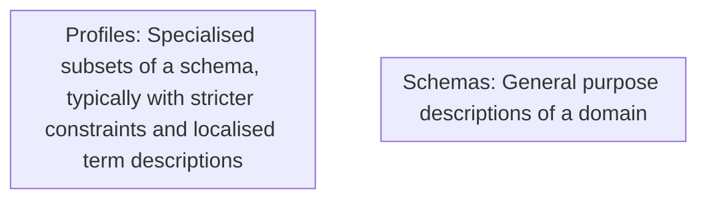
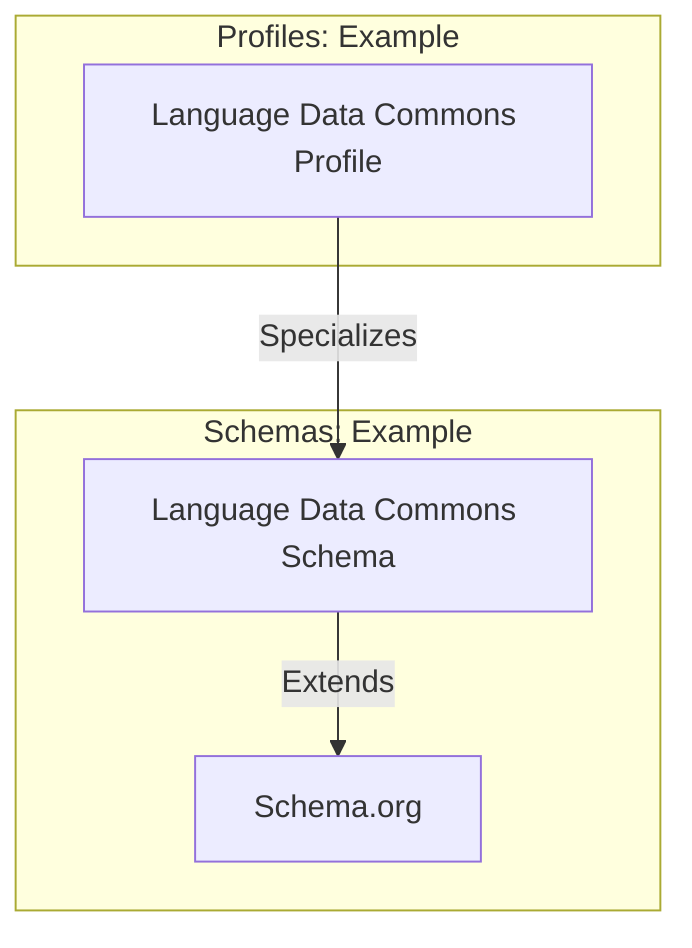
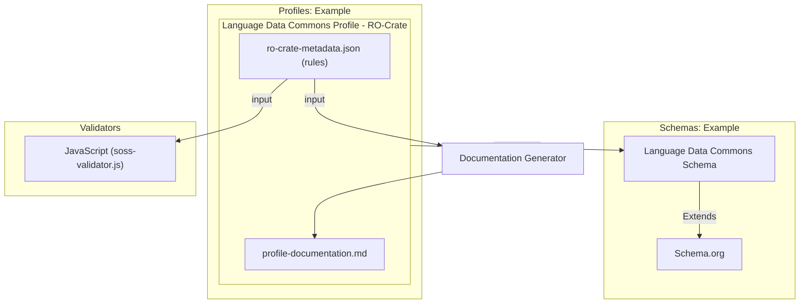

# RO-Crate Machine Actionable Schemas and Profiles (MASP)

This profile describes the structure of an RO-Crate MASP **Profile Crate** — a crate that contains machine-readable validation rules for other RO-Crates. It is used both as documentation and as input to the MASP validator and documentation generator. This profile is self-describing: the MASP profile crate is itself a valid instance of this profile.

## Background

### Definitions

| Term | Definition |
|------|------------|
| **General Purpose Schema** | A specification of Classes and Properties intended for use across multiple profiles (e.g. Schema.org, Dublin Core, Darwin Core). These may have loose range/domain constraints, typically with inheritance (a `Person` is a subclass of `Thing`). |
| **Schema Language** | The formalisation used to express a schema. Examples include RDF Schema (RDFS), OWL, SKOS, and Schema.org's own data model. |
| **SoSS (Schema.org Style Schema)** | Schema.org's data model expressed as a set of `rdfs:Class` and `rdf:Property` definitions in JSON-LD. RO-Crate 1.2 uses this approach for adding extra vocabulary terms to crates and profiles. |
| **Profile Specific Schema** | A schema specialised for a particular domain. For example, the Language Data Commons has a general-purpose SoSS at `http://w3id.org/ldac/terms` and a stricter profile at `https://w3id.org/ldac/profile`. |
| **Class** | A named type applied to entities via the `@type` property. MASP uses `rdfs:Class` as per Schema.org's data model. |
| **Property** | An attribute of an entity. MASP uses `rdf:Property` as per Schema.org's data model. |
| **Profile** | A specialisation of a standard or specification, as defined by the [W3C Profiles Vocabulary](https://www.w3.org/TR/dx-prof/). A profile introduces constraints or extensions that make a standard suitable for a particular purpose. Profile Crates are profiles of RO-Crate. |
| **Profile Crate** | An RO-Crate whose root entity has `@type: ["Dataset", "Profile"]` and contains machine-readable schema rules alongside human-readable documentation. The structure is defined in the [RO-Crate 1.2 Profiles specification](https://www.researchobject.org/ro-crate/specification/1.2/profiles.html). |

The relationship between schemas and profiles:



An example with real vocabularies:



Both schemas and profiles can be expressed in RO-Crate MASP:



### Background: Schema.org Style Schemas

Schema.org describes its vocabulary using `rdf:Property` and `rdfs:Class` entities. RO-Crate has used this convention since its inception. For example, the Schema.org definition of `author`:

```json
{
  "@id": "schema:author",
  "@type": "rdf:Property",
  "rdfs:comment": "The author of this content.",
  "rdfs:label": "author",
  "schema:domainIncludes": [
    {"@id": "schema:CreativeWork"}
  ],
  "schema:rangeIncludes": [
    {"@id": "schema:Organization"},
    {"@id": "schema:Person"}
  ]
}
```

MASP extends this approach with a few additions — `prov:specializationOf` to link a profile-specific class or property to its base vocabulary term, and `sh:minCount`/`sh:maxCount` borrowed from SHACL to express cardinality.

## Profile Specific Schemas

A MASP profile-specific schema specializes Schema.org-style terms for a particular context. The key differences from plain Schema.org style:

- `prov:specializationOf` links the local rule to the base vocabulary term it constrains (specialises)
- `domainIncludes` (without `schema:` prefix — the validator resolves this via the RO-Crate JSON-LD context) links a property rule to its class rule
- `sh:minCount` and `sh:maxCount` express how many times a property must appear

Example class and property rules for a hypothetical scholarly profile:

```json
{
  "@id": "#class_ScholarlyArticle",
  "@type": "rdfs:Class",
  "prov:specializationOf": {"@id": "https://schema.org/ScholarlyArticle"},
  "rdfs:label": "ScholarlyArticle",
  "rdfs:comment": "A scholarly article in this profile's context.",
  "sh:minCount": 1,
  "sh:maxCount": 1
},
{
  "@id": "#prop_author_ScholarlyArticle",
  "@type": "rdf:Property",
  "prov:specializationOf": {"@id": "https://schema.org/author"},
  "rdfs:label": "author",
  "rdfs:comment": "The author(s) of this scholarly article.",
  "domainIncludes": {"@id": "#class_ScholarlyArticle"},
  "rangeIncludes": {"@id": "#class_Person"},
  "sh:minCount": 1
}
```

**Important**: use `domainIncludes` (not `schema:domainIncludes`) — the validator resolves property names through the RO-Crate JSON-LD context, where the `schema:` prefix is not defined by default.

### Linking the Metadata Descriptor

Every MASP profile must define how to find the root class rule which describes the RO-Crate [Root Data Entity](https://www.researchobject.org/ro-crate/specification/1.2/terminology.html). This is done via a special property rule whose `rdfs:label` is `"@id"` and whose `rangeIncludes` points to a `PropertyValue` containing `"ro-crate-metadata.json"`. The validator detects this pattern to identify which class rule is the Metadata Descriptor — and from there, follows `about` to find the Root Data Entity class:
 
```json
{
  "@id": "#class_MetadataDescriptor",
  "@type": "rdfs:Class",
  "prov:specializationOf": {"@id": "http://schema.org/CreativeWork"},
  "sh:minCount": 1,
  "sh:maxCount": 1
},
{
  "@id": "#prop_id_MetadataDescriptor",
  "@type": "rdf:Property",
  "rdfs:label": "@id",
  "rangeIncludes": {"@id": "#propertyValue_prop_id_MetadataDescriptor"},
  "domainIncludes": {"@id": "#class_MetadataDescriptor"},
  "sh:minCount": 1,
  "sh:maxCount": 1
},
{
  "@id": "#propertyValue_prop_id_MetadataDescriptor",
  "@type": "PropertyValue",
  "name": "RO-Crate Metadata Descriptor Identifier Constraint",
  "value": "ro-crate-metadata.json",
  "sh:minCount": 1,
  "sh:maxCount": 1
},
{
  "@id": "#prop_about_MetadataDescriptor",
  "@type": "rdf:Property",
  "prov:specializationOf": {"@id": "http://schema.org/about"},
  "rdfs:label": "about",
  "domainIncludes": {"@id": "#class_MetadataDescriptor"},
  "rangeIncludes": {"@id": "#class_RootDataEntity"},
  "sh:minCount": 1,
  "sh:maxCount": 1
}
```

The validator uses the `#prop_id_MetadataDescriptor` pattern (`rdfs:label: "@id"` + `rangeIncludes` to a `PropertyValue` containing `"ro-crate-metadata.json"`) to locate the root class rule at parse time.

### How the Validator Finds Schema Rules

The validator locates schema rules by inspecting the profile's `hasResource` array for a `ResourceDescriptor` entity with `hasRole` pointing to `http://www.w3.org/ns/dx/prof/role/schema`. The `hasPart` array of that descriptor lists all the schema entities (`rdfs:Class`, `rdf:Property`, `ItemList`, `DefinedTermSet`):

```json
{
  "@id": "#hasSpecializedSchema",
  "@type": "ResourceDescriptor",
  "hasRole": {"@id": "http://www.w3.org/ns/dx/prof/role/schema"},
  "hasPart": [
    {"@id": "#class_MetadataDescriptor"},
    {"@id": "#prop_id_MetadataDescriptor"},
    {"@id": "#prop_about_MetadataDescriptor"},
    ...
  ]
}
```

Only entities listed here are treated as validation rules. Other entities in the crate (documentation files, authors, etc.) are ignored by the validator.

## Validation Algorithm

The validator (`soss-validator.js`) works as follows:

1. **Find the schema ResourceDescriptor** — locate the `ResourceDescriptor` with `role/schema` in `hasResource` and read its `hasPart` list.

2. **Parse rules** — for each entity in `hasPart`:
   - `rdfs:Class` → `ClassRule` (type matching + cardinality)
  - `rdf:Property` → `PropertyRule` (presence, cardinality, range, PropertyValue constraints)
   - `ItemList` → `ItemListRule` (enumerated allowed values)
  - `PropertyValue` → value constraint wrappers referenced from property `rangeIncludes`
   - `DefinedTermSet` → `TermRule` (term documentation; currently pass-through)

3. **Detect root class rule** — the property rule with `rdfs:label: "@id"` and a `rangeIncludes` reference to a `PropertyValue` containing `"ro-crate-metadata.json"` identifies the Metadata Descriptor class rule. This sets the starting point for validation.

4. **Validate the target crate** — for each class rule, iterate all entities in the target crate:
   - Resolve the entity's `@type` values through the target crate's JSON-LD context
   - Compare against the class rule's `prov:specializationOf` resolved types
   - If the types match, validate all property rules linked to that class via `domainIncludes`
   - Count valid instances and check against `sh:minCount`/`sh:maxCount`

5. **Property rule validation** — for each matching entity:
  - Check cardinality (`sh:minCount`, `sh:maxCount`)
  - If `rangeIncludes` references one or more `PropertyValue` entities, apply those literal/object/regex constraints
   - If `rangeIncludes` is set, validate each value: primitive types (Text, Number, Boolean, Date) are checked by JS type; entity references are looked up in the crate and validated recursively against the referenced class rule; `ItemList` values are checked against the list's `itemListElement` entries

6. **Results** — the validator returns `{ error, success, rules }` where `rules` contains per-entity property success/error details keyed by rule ID and entity ID.

### Cardinality on Classes vs Properties

`sh:minCount`/`sh:maxCount` mean different things depending on where they appear:

| Location | Meaning |
|----------|---------|
| On an `rdfs:Class` entity | How many instances of this type must exist in the whole crate |
| On an `rdf:Property` entity | How many values this property must/may have on each matching entity |

### PropertyValue Constraints

Literal and pattern-based constraints are expressed with `PropertyValue` entities that are referenced from property `rangeIncludes`.

- Use a `PropertyValue` with a literal `value` for exact matches (for example the metadata descriptor `@id`).
- Use a `PropertyValue` with regex literal strings (for example `/^readme\\.md$/i`) for pattern-based checks.
- Keep `rdf:Property` rules focused on domain, cardinality, and linkage to constraints via `rangeIncludes`.

### ItemList Validation

When a property's `rangeIncludes` references an `ItemList` entity, the value must match one of the `itemListElement` entries by `@id`. Item elements can include additional properties that must also match, allowing for constrained contextual entity definitions within a profile.

## Types of entities (specializations of Classes) and expected Properties


### <a id="class_MetadataDescriptor" title="#class_MetadataDescriptor"></a> Class: RO-Crate Metadata Descriptor

The ro-crate-metadata.json file entity that describes the profile crate.

At least 1 instances of this type MUST be present in the crate.

 A maximum of 1 instances of this type  MAY be present in the crate.

| Min Count | Max Count |
| --------- | --------- |
| 1 | 1 |

| Property | Specialization Of | Required | Description | Range | Value |
| -------- | ----------------- | -------- | ----------- | ----- | ----- |
| @type |  | Yes |  |  | <a href="http://schema.org/CreativeWork" title="http://schema.org/CreativeWork" target="_blank" rel="noopener">CreativeWork</a> |
| <a href="#prop_id_MetadataDescriptor" title="#prop_id_MetadataDescriptor">@id</a> |  | Yes |  | <a href="#propertyValue_prop_id_MetadataDescriptor" title="#propertyValue_prop_id_MetadataDescriptor">RO-Crate Metadata Descriptor Identifier Constraint</a> |  |
| <a href="#prop_about_MetadataDescriptor" title="#prop_about_MetadataDescriptor">about</a> | <a href="http://schema.org/about" target="_blank" rel="noopener">http://schema.org/about</a> | Yes | MUST reference the root profile Dataset entity. | <a href="#class_ProfileDataset" title="#class_ProfileDataset">Profile Dataset</a> |  |
| <a href="#prop_conformsTo_MetadataDescriptor" title="#prop_conformsTo_MetadataDescriptor">conformsTo</a> | <a href="http://schema.org/conformsTo" target="_blank" rel="noopener">http://schema.org/conformsTo</a> | Yes | MUST reference the RO-Crate specification the crate conforms to. | <a href="#class_CreativeWork" title="#class_CreativeWork">CreativeWork</a> |  |

### Examples of Type
#### Examples
-  [Example-1: ro-crate-metadata.json](#ro-crate-metadata.json)


### <a id="class_ProfileDataset" title="#class_ProfileDataset"></a> Class: Profile Dataset

The root entity of a MASP profile crate. Must have @type [Dataset, Profile].

At least 1 instances of this type MUST be present in the crate.

 A maximum of 1 instances of this type  MAY be present in the crate.

| Min Count | Max Count |
| --------- | --------- |
| 1 | 1 |

| Property | Specialization Of | Required | Description | Range | Value |
| -------- | ----------------- | -------- | ----------- | ----- | ----- |
| @type |  | Yes |  |  | <a href="http://schema.org/Dataset" title="http://schema.org/Dataset" target="_blank" rel="noopener">Dataset</a>, <a href="http://www.w3.org/ns/dx/prof/Profile" title="http://www.w3.org/ns/dx/prof/Profile" target="_blank" rel="noopener">Profile</a> |
| <a href="#prop_hasResource_ProfileDataset" title="#prop_hasResource_ProfileDataset">hasResource</a> | <a href="http://www.w3.org/ns/dx/prof/hasResource" target="_blank" rel="noopener">http://www.w3.org/ns/dx/prof/hasResource</a> | Yes | Links to ResourceDescriptor entities that describe the profile's resources. MUST include at least one descriptor with role/specification. | <a href="#class_ResourceDescriptor" title="#class_ResourceDescriptor">ResourceDescriptor</a> |  |
| <a href="#prop_isProfileOf_ProfileDataset" title="#prop_isProfileOf_ProfileDataset">isProfileOf</a> | <a href="http://schema.org/isProfileOf" target="_blank" rel="noopener">http://schema.org/isProfileOf</a> | Yes | MUST reference the base RO-Crate specification this profile extends. | <a href="#class_CreativeWork" title="#class_CreativeWork">CreativeWork</a> |  |
| <a href="#prop_license_ProfileDataset" title="#prop_license_ProfileDataset">license</a> | <a href="http://schema.org/license" target="_blank" rel="noopener">http://schema.org/license</a> | Yes | License for this profile. | <a href="#class_CreativeWork" title="#class_CreativeWork">CreativeWork</a>, Text |  |
| <a href="#prop_name_ProfileDataset" title="#prop_name_ProfileDataset">name</a> | <a href="http://schema.org/name" target="_blank" rel="noopener">http://schema.org/name</a> | Yes | A human-readable name for the profile. | Text |  |
| <a href="#prop_author_ProfileDataset" title="#prop_author_ProfileDataset">author</a> | <a href="http://schema.org/author" target="_blank" rel="noopener">http://schema.org/author</a> | No | The person or organization responsible for creating this profile. | <a href="#class_Person" title="#class_Person">Person</a>, <a href="#class_Organization" title="#class_Organization">Organization</a> |  |
| <a href="#prop_description_ProfileDataset" title="#prop_description_ProfileDataset">description</a> | <a href="http://schema.org/description" target="_blank" rel="noopener">http://schema.org/description</a> | No | A description of the profile and its intended use. | Text |  |
| <a href="#prop_hasPart_ProfileDataset" title="#prop_hasPart_ProfileDataset">hasPart</a> | <a href="http://schema.org/hasPart" target="_blank" rel="noopener">http://schema.org/hasPart</a> | No | Files that are part of this profile crate. | <a href="#class_File" title="#class_File">File</a> |  |
| <a href="#prop_version_ProfileDataset" title="#prop_version_ProfileDataset">version</a> | <a href="http://schema.org/version" target="_blank" rel="noopener">http://schema.org/version</a> | No | The version of this profile using semantic versioning (MAJOR.MINOR.PATCH). | Text |  |

### Examples of Type
#### Examples
-  [Example-1: https://language-research-technology.github.io/ro-crate-masp/profiles/ro-crate-masp/profile-crate/](#https%3A%2F%2Flanguage-research-technology.github.io%2Fro-crate-masp%2Fprofiles%2Fro-crate-masp%2Fprofile-crate%2F)


### <a id="class_ResourceDescriptor" title="#class_ResourceDescriptor"></a> Class: ResourceDescriptor

Describes a resource that is part of a profile, using the W3C Profiles Vocabulary.

Instances of this type MAY be present in the crate.

| Min Count | Max Count |
| --------- | --------- |
| N/A | N/A |

| Property | Specialization Of | Required | Description | Range | Value |
| -------- | ----------------- | -------- | ----------- | ----- | ----- |
| @type |  | Yes |  |  | <a href="http://www.w3.org/ns/dx/prof/ResourceDescriptor" title="http://www.w3.org/ns/dx/prof/ResourceDescriptor" target="_blank" rel="noopener">ResourceDescriptor</a> |
| <a href="#prop_hasRole_ResourceDescriptor" title="#prop_hasRole_ResourceDescriptor">hasRole</a> | <a href="http://www.w3.org/ns/dx/prof/hasRole" target="_blank" rel="noopener">http://www.w3.org/ns/dx/prof/hasRole</a> | Yes | The role of this resource within the profile (e.g. role/specification, role/schema, role/guidance). Value is a URI from the W3C PROF vocabulary. |  |  |
| <a href="#prop_hasArtifact_ResourceDescriptor" title="#prop_hasArtifact_ResourceDescriptor">hasArtifact</a> | <a href="http://www.w3.org/ns/dx/prof/hasArtifact" target="_blank" rel="noopener">http://www.w3.org/ns/dx/prof/hasArtifact</a> | No | The artifact for this resource descriptor — a File, LearningResource, or other entity. Range validation intentionally omitted as artifacts can be any type. |  |  |
| <a href="#prop_hasPart_ResourceDescriptor" title="#prop_hasPart_ResourceDescriptor">hasPart</a> | <a href="http://schema.org/hasPart" target="_blank" rel="noopener">http://schema.org/hasPart</a> | No | For schema ResourceDescriptors: the individual schema entities (classes, properties, item lists) that make up the schema. |  |  |

### Examples of Type
#### Examples
-  [Example-1: #hasSpecializedSchema](#hasSpecializedSchema)


### <a id="class_rdfsClass" title="#class_rdfsClass"></a> Class: rdfs:Class

A class definition in a MASP schema. Defines a type of entity and its cardinality constraints.

Instances of this type MAY be present in the crate.

| Min Count | Max Count |
| --------- | --------- |
| N/A | N/A |

| Property | Specialization Of | Required | Description | Range | Value |
| -------- | ----------------- | -------- | ----------- | ----- | ----- |
| @type |  | Yes |  |  | <a href="http://www.w3.org/2000/01/rdf-schema#Class" title="http://www.w3.org/2000/01/rdf-schema#Class" target="_blank" rel="noopener">Class</a> |
| <a href="#prop_specializationOf_rdfsClass" title="#prop_specializationOf_rdfsClass">prov:specializationOf</a> | <a href="http://www.w3.org/ns/prov#specializationOf" target="_blank" rel="noopener">http://www.w3.org/ns/prov#specializationOf</a> | No | The base schema.org (or other vocabulary) type this class specializes. Value is a URI reference; range validation is intentionally omitted as these are external vocab URIs. |  |  |
| <a href="#prop_label_rdfsClass" title="#prop_label_rdfsClass">rdfs:label</a> | <a href="http://www.w3.org/2000/01/rdf-schema#label" target="_blank" rel="noopener">http://www.w3.org/2000/01/rdf-schema#label</a> | No | An optional rdfs:label for the class. In practice, class entities typically use 'name' as their human-readable label. | Text |  |
| <a href="#prop_maxCount_rdfsClass" title="#prop_maxCount_rdfsClass">sh:maxCount</a> | <a href="http://www.w3.org/ns/shacl#maxCount" target="_blank" rel="noopener">http://www.w3.org/ns/shacl#maxCount</a> | No | Maximum number of instances of this class allowed in a conforming crate. | Integer |  |
| <a href="#prop_minCount_rdfsClass" title="#prop_minCount_rdfsClass">sh:minCount</a> | <a href="http://www.w3.org/ns/shacl#minCount" target="_blank" rel="noopener">http://www.w3.org/ns/shacl#minCount</a> | No | Minimum number of instances of this class that MUST appear in a conforming crate. | Integer |  |

### Examples of Type
#### Examples
-  [Example-1: #class_ProfileDataset](#class_ProfileDataset)

-  [Example-1: #class_MetadataDescriptor](#class_MetadataDescriptor)


### <a id="class_rdfProperty" title="#class_rdfProperty"></a> Class: rdf:Property

A property definition in a MASP schema. Defines a property, its domain class, range, and cardinality constraints.

Instances of this type MAY be present in the crate.

| Min Count | Max Count |
| --------- | --------- |
| N/A | N/A |

| Property | Specialization Of | Required | Description | Range | Value |
| -------- | ----------------- | -------- | ----------- | ----- | ----- |
| @type |  | Yes |  |  | <a href="http://www.w3.org/1999/02/22-rdf-syntax-ns#Property" title="http://www.w3.org/1999/02/22-rdf-syntax-ns#Property" target="_blank" rel="noopener">Property</a> |
| <a href="#prop_domainIncludes_rdfProperty" title="#prop_domainIncludes_rdfProperty">domainIncludes</a> | <a href="http://schema.org/domainIncludes" target="_blank" rel="noopener">http://schema.org/domainIncludes</a> | Yes | The class(es) that this property applies to. | <a href="#class_rdfsClass" title="#class_rdfsClass">Class</a> |  |
| <a href="#prop_label_rdfProperty" title="#prop_label_rdfProperty">rdfs:label</a> | <a href="http://www.w3.org/2000/01/rdf-schema#label" target="_blank" rel="noopener">http://www.w3.org/2000/01/rdf-schema#label</a> | Yes | A human-readable label for the property, usually matching the property name. | Text |  |
| <a href="#prop_specializationOf_rdfProperty" title="#prop_specializationOf_rdfProperty">prov:specializationOf</a> | <a href="http://www.w3.org/ns/prov#specializationOf" target="_blank" rel="noopener">http://www.w3.org/ns/prov#specializationOf</a> | No | The base vocabulary property this property specializes. Value is an external URI reference; range validation intentionally omitted. |  |  |
| <a href="#prop_rangeIncludes_rdfProperty" title="#prop_rangeIncludes_rdfProperty">rangeIncludes</a> | <a href="http://schema.org/rangeIncludes" target="_blank" rel="noopener">http://schema.org/rangeIncludes</a> | No | The expected value type(s) for this property. Range validation is intentionally omitted because these reference external schema types (Text, URL, Integer, etc.) that are not entities in the crate. |  |  |
| <a href="#prop_maxCount_rdfProperty" title="#prop_maxCount_rdfProperty">sh:maxCount</a> | <a href="http://www.w3.org/ns/shacl#maxCount" target="_blank" rel="noopener">http://www.w3.org/ns/shacl#maxCount</a> | No | Maximum number of times this property MAY appear on entities of the domain class. | Integer |  |
| <a href="#prop_minCount_rdfProperty" title="#prop_minCount_rdfProperty">sh:minCount</a> | <a href="http://www.w3.org/ns/shacl#minCount" target="_blank" rel="noopener">http://www.w3.org/ns/shacl#minCount</a> | No | Minimum number of times this property MUST appear on entities of the domain class. | Integer |  |
| <a href="#prop_value_rdfProperty" title="#prop_value_rdfProperty">value</a> | <a href="http://schema.org/value" target="_blank" rel="noopener">http://schema.org/value</a> | No | Constraint content carried by a PropertyValue entity. Property rules SHOULD reference PropertyValue via rangeIncludes rather than storing literal constraints directly on rdf:Property. | Text |  |

### Examples of Type
#### Examples
-  [Example-1: #prop_name_ProfileDataset](#prop_name_ProfileDataset)

-  [Example-1: #prop_isProfileOf_ProfileDataset](#prop_isProfileOf_ProfileDataset)

-  [Example-1: #prop_id_MetadataDescriptor](#prop_id_MetadataDescriptor)


### <a id="class_ItemList" title="#class_ItemList"></a> Class: ItemList

A list of allowed values for a property. When a property's rangeIncludes is an ItemList, values MUST be drawn from the list.

Instances of this type MAY be present in the crate.

| Min Count | Max Count |
| --------- | --------- |
| N/A | N/A |

| Property | Specialization Of | Required | Description | Range | Value |
| -------- | ----------------- | -------- | ----------- | ----- | ----- |
| @type |  | Yes |  |  | <a href="http://schema.org/ItemList" title="http://schema.org/ItemList" target="_blank" rel="noopener">ItemList</a> |
| <a href="#prop_itemListElement_ItemList" title="#prop_itemListElement_ItemList">itemListElement</a> | <a href="http://schema.org/itemListElement" target="_blank" rel="noopener">http://schema.org/itemListElement</a> | Yes | The items in this list. Each item is an entity whose @id is an allowed value. |  |  |


### <a id="class_DefinedTermSet" title="#class_DefinedTermSet"></a> Class: DefinedTermSet

A set of defined vocabulary terms.

Instances of this type MAY be present in the crate.

| Min Count | Max Count |
| --------- | --------- |
| N/A | N/A |

| Property | Specialization Of | Required | Description | Range | Value |
| -------- | ----------------- | -------- | ----------- | ----- | ----- |
| @type |  | Yes |  |  | <a href="http://schema.org/DefinedTermSet" title="http://schema.org/DefinedTermSet" target="_blank" rel="noopener">DefinedTermSet</a> |
| <a href="#prop_name_DefinedTermSet" title="#prop_name_DefinedTermSet">name</a> | <a href="http://schema.org/name" target="_blank" rel="noopener">http://schema.org/name</a> | Yes | The name of this term set. | Text |  |


### <a id="class_DefinedTerm" title="#class_DefinedTerm"></a> Class: DefinedTerm

A single vocabulary term within a DefinedTermSet.

Instances of this type MAY be present in the crate.

| Min Count | Max Count |
| --------- | --------- |
| N/A | N/A |

| Property | Specialization Of | Required | Description | Range | Value |
| -------- | ----------------- | -------- | ----------- | ----- | ----- |
| @type |  | Yes |  |  | <a href="http://schema.org/DefinedTerm" title="http://schema.org/DefinedTerm" target="_blank" rel="noopener">DefinedTerm</a> |
| <a href="#prop_name_DefinedTerm" title="#prop_name_DefinedTerm">name</a> | <a href="http://schema.org/name" target="_blank" rel="noopener">http://schema.org/name</a> | Yes | The name of this term. | Text |  |
| <a href="#prop_inDefinedTermSet_DefinedTerm" title="#prop_inDefinedTermSet_DefinedTerm">inDefinedTermSet</a> | <a href="http://schema.org/inDefinedTermSet" target="_blank" rel="noopener">http://schema.org/inDefinedTermSet</a> | No | The DefinedTermSet this term belongs to. | <a href="#class_DefinedTermSet" title="#class_DefinedTermSet">DefinedTermSet</a> |  |


### <a id="class_Person" title="#class_Person"></a> Class: Person

A person, used as an author or contributor.

Instances of this type MAY be present in the crate.

| Min Count | Max Count |
| --------- | --------- |
| N/A | N/A |

| Property | Specialization Of | Required | Description | Range | Value |
| -------- | ----------------- | -------- | ----------- | ----- | ----- |
| @type |  | Yes |  |  | <a href="http://schema.org/Person" title="http://schema.org/Person" target="_blank" rel="noopener">Person</a> |
*No properties defined for this class*


### <a id="class_Organization" title="#class_Organization"></a> Class: Organization

An organization, used as an author, publisher, or contributor.

Instances of this type MAY be present in the crate.

| Min Count | Max Count |
| --------- | --------- |
| N/A | N/A |

| Property | Specialization Of | Required | Description | Range | Value |
| -------- | ----------------- | -------- | ----------- | ----- | ----- |
| @type |  | Yes |  |  | <a href="http://schema.org/Organization" title="http://schema.org/Organization" target="_blank" rel="noopener">Organization</a> |
*No properties defined for this class*


### <a id="class_File" title="#class_File"></a> Class: File

A file that is part of a profile crate.

Instances of this type MAY be present in the crate.

| Min Count | Max Count |
| --------- | --------- |
| N/A | N/A |

| Property | Specialization Of | Required | Description | Range | Value |
| -------- | ----------------- | -------- | ----------- | ----- | ----- |
| @type |  | Yes |  |  | <a href="http://schema.org/MediaObject" title="http://schema.org/MediaObject" target="_blank" rel="noopener">MediaObject</a> |
*No properties defined for this class*


### <a id="class_CreativeWork" title="#class_CreativeWork"></a> Class: CreativeWork

A creative work, used for licenses and specification references.

Instances of this type MAY be present in the crate.

| Min Count | Max Count |
| --------- | --------- |
| N/A | N/A |

| Property | Specialization Of | Required | Description | Range | Value |
| -------- | ----------------- | -------- | ----------- | ----- | ----- |
| @type |  | Yes |  |  | <a href="http://schema.org/CreativeWork" title="http://schema.org/CreativeWork" target="_blank" rel="noopener">CreativeWork</a> |
*No properties defined for this class*


### Examples of Type
#### Examples
-  [Example-1: ro-crate-metadata.json](#ro-crate-metadata.json)


### <a id="class_ResourceRole" title="#class_ResourceRole"></a> Class: ResourceRole

A role URI from the W3C Profiles Vocabulary (http://www.w3.org/ns/dx/prof/role/).

Instances of this type MAY be present in the crate.

| Min Count | Max Count |
| --------- | --------- |
| N/A | N/A |

| Property | Specialization Of | Required | Description | Range | Value |
| -------- | ----------------- | -------- | ----------- | ----- | ----- |
| @type |  | Yes |  |  | <a href="http://www.w3.org/ns/dx/prof/ResourceRole" title="http://www.w3.org/ns/dx/prof/ResourceRole" target="_blank" rel="noopener">ResourceRole</a> |
*No properties defined for this class*


## All Properties

### <a id="prop_id_MetadataDescriptor" title="#prop_id_MetadataDescriptor"></a> Property: @id

| Property | Description | Range | Occurs in Domain(s) |
| -------- | ----------- | ----------- | ----------- |
| <a href="#prop_id_MetadataDescriptor" title="#prop_id_MetadataDescriptor">@id</a> |  | <a href="#propertyValue_prop_id_MetadataDescriptor" title="#propertyValue_prop_id_MetadataDescriptor">RO-Crate Metadata Descriptor Identifier Constraint</a> | <a href="#class_MetadataDescriptor" title="#class_MetadataDescriptor">RO-Crate Metadata Descriptor</a> |
### <a id="prop_about_MetadataDescriptor" title="#prop_about_MetadataDescriptor"></a> Property: about

| Property | Specialization Of | Description | Range | Occurs in Domain(s) |
| -------- | ----------------- | ----------- | ----------- | ----------- |
| <a href="#prop_about_MetadataDescriptor" title="#prop_about_MetadataDescriptor">about</a> | <a href="http://schema.org/about" target="_blank" rel="noopener">http://schema.org/about</a> | MUST reference the root profile Dataset entity. | <a href="#class_ProfileDataset" title="#class_ProfileDataset">Profile Dataset</a> | <a href="#class_MetadataDescriptor" title="#class_MetadataDescriptor">RO-Crate Metadata Descriptor</a> |
### <a id="prop_author_ProfileDataset" title="#prop_author_ProfileDataset"></a> Property: author

| Property | Specialization Of | Description | Range | Occurs in Domain(s) |
| -------- | ----------------- | ----------- | ----------- | ----------- |
| <a href="#prop_author_ProfileDataset" title="#prop_author_ProfileDataset">author</a> | <a href="http://schema.org/author" target="_blank" rel="noopener">http://schema.org/author</a> | The person or organization responsible for creating this profile. | <a href="#class_Person" title="#class_Person">Person</a>, <a href="#class_Organization" title="#class_Organization">Organization</a> | <a href="#class_ProfileDataset" title="#class_ProfileDataset">Profile Dataset</a> |
### <a id="prop_conformsTo_MetadataDescriptor" title="#prop_conformsTo_MetadataDescriptor"></a> Property: conformsTo

| Property | Specialization Of | Description | Range | Occurs in Domain(s) |
| -------- | ----------------- | ----------- | ----------- | ----------- |
| <a href="#prop_conformsTo_MetadataDescriptor" title="#prop_conformsTo_MetadataDescriptor">conformsTo</a> | <a href="http://schema.org/conformsTo" target="_blank" rel="noopener">http://schema.org/conformsTo</a> | MUST reference the RO-Crate specification the crate conforms to. | <a href="#class_CreativeWork" title="#class_CreativeWork">CreativeWork</a> | <a href="#class_MetadataDescriptor" title="#class_MetadataDescriptor">RO-Crate Metadata Descriptor</a> |
### <a id="prop_description_ProfileDataset" title="#prop_description_ProfileDataset"></a> Property: description

| Property | Specialization Of | Description | Range | Occurs in Domain(s) |
| -------- | ----------------- | ----------- | ----------- | ----------- |
| <a href="#prop_description_ProfileDataset" title="#prop_description_ProfileDataset">description</a> | <a href="http://schema.org/description" target="_blank" rel="noopener">http://schema.org/description</a> | A description of the profile and its intended use. | Text | <a href="#class_ProfileDataset" title="#class_ProfileDataset">Profile Dataset</a> |
### <a id="prop_domainIncludes_rdfProperty" title="#prop_domainIncludes_rdfProperty"></a> Property: domainIncludes

| Property | Specialization Of | Description | Range | Occurs in Domain(s) |
| -------- | ----------------- | ----------- | ----------- | ----------- |
| <a href="#prop_domainIncludes_rdfProperty" title="#prop_domainIncludes_rdfProperty">domainIncludes</a> | <a href="http://schema.org/domainIncludes" target="_blank" rel="noopener">http://schema.org/domainIncludes</a> | The class(es) that this property applies to. | <a href="#class_rdfsClass" title="#class_rdfsClass">Class</a> | <a href="#class_rdfProperty" title="#class_rdfProperty">Property</a> |
### <a id="prop_hasArtifact_ResourceDescriptor" title="#prop_hasArtifact_ResourceDescriptor"></a> Property: hasArtifact

| Property | Specialization Of | Description | Range | Occurs in Domain(s) |
| -------- | ----------------- | ----------- | ----------- | ----------- |
| <a href="#prop_hasArtifact_ResourceDescriptor" title="#prop_hasArtifact_ResourceDescriptor">hasArtifact</a> | <a href="http://www.w3.org/ns/dx/prof/hasArtifact" target="_blank" rel="noopener">http://www.w3.org/ns/dx/prof/hasArtifact</a> | The artifact for this resource descriptor — a File, LearningResource, or other entity. Range validation intentionally omitted as artifacts can be any type. |  | <a href="#class_ResourceDescriptor" title="#class_ResourceDescriptor">ResourceDescriptor</a> |
### <a id="prop_hasPart_ProfileDataset" title="#prop_hasPart_ProfileDataset"></a> Property: hasPart

| Property | Specialization Of | Description | Range | Occurs in Domain(s) |
| -------- | ----------------- | ----------- | ----------- | ----------- |
| <a href="#prop_hasPart_ProfileDataset" title="#prop_hasPart_ProfileDataset">hasPart</a> | <a href="http://schema.org/hasPart" target="_blank" rel="noopener">http://schema.org/hasPart</a> | Files that are part of this profile crate. | <a href="#class_File" title="#class_File">File</a> | <a href="#class_ProfileDataset" title="#class_ProfileDataset">Profile Dataset</a> |
### <a id="prop_hasPart_ResourceDescriptor" title="#prop_hasPart_ResourceDescriptor"></a> Property: hasPart

| Property | Specialization Of | Description | Range | Occurs in Domain(s) |
| -------- | ----------------- | ----------- | ----------- | ----------- |
| <a href="#prop_hasPart_ResourceDescriptor" title="#prop_hasPart_ResourceDescriptor">hasPart</a> | <a href="http://schema.org/hasPart" target="_blank" rel="noopener">http://schema.org/hasPart</a> | For schema ResourceDescriptors: the individual schema entities (classes, properties, item lists) that make up the schema. |  | <a href="#class_ResourceDescriptor" title="#class_ResourceDescriptor">ResourceDescriptor</a> |
### <a id="prop_hasResource_ProfileDataset" title="#prop_hasResource_ProfileDataset"></a> Property: hasResource

| Property | Specialization Of | Description | Range | Occurs in Domain(s) |
| -------- | ----------------- | ----------- | ----------- | ----------- |
| <a href="#prop_hasResource_ProfileDataset" title="#prop_hasResource_ProfileDataset">hasResource</a> | <a href="http://www.w3.org/ns/dx/prof/hasResource" target="_blank" rel="noopener">http://www.w3.org/ns/dx/prof/hasResource</a> | Links to ResourceDescriptor entities that describe the profile's resources. MUST include at least one descriptor with role/specification. | <a href="#class_ResourceDescriptor" title="#class_ResourceDescriptor">ResourceDescriptor</a> | <a href="#class_ProfileDataset" title="#class_ProfileDataset">Profile Dataset</a> |
### <a id="prop_hasRole_ResourceDescriptor" title="#prop_hasRole_ResourceDescriptor"></a> Property: hasRole

| Property | Specialization Of | Description | Range | Occurs in Domain(s) |
| -------- | ----------------- | ----------- | ----------- | ----------- |
| <a href="#prop_hasRole_ResourceDescriptor" title="#prop_hasRole_ResourceDescriptor">hasRole</a> | <a href="http://www.w3.org/ns/dx/prof/hasRole" target="_blank" rel="noopener">http://www.w3.org/ns/dx/prof/hasRole</a> | The role of this resource within the profile (e.g. role/specification, role/schema, role/guidance). Value is a URI from the W3C PROF vocabulary. |  | <a href="#class_ResourceDescriptor" title="#class_ResourceDescriptor">ResourceDescriptor</a> |
### <a id="prop_inDefinedTermSet_DefinedTerm" title="#prop_inDefinedTermSet_DefinedTerm"></a> Property: inDefinedTermSet

| Property | Specialization Of | Description | Range | Occurs in Domain(s) |
| -------- | ----------------- | ----------- | ----------- | ----------- |
| <a href="#prop_inDefinedTermSet_DefinedTerm" title="#prop_inDefinedTermSet_DefinedTerm">inDefinedTermSet</a> | <a href="http://schema.org/inDefinedTermSet" target="_blank" rel="noopener">http://schema.org/inDefinedTermSet</a> | The DefinedTermSet this term belongs to. | <a href="#class_DefinedTermSet" title="#class_DefinedTermSet">DefinedTermSet</a> | <a href="#class_DefinedTerm" title="#class_DefinedTerm">DefinedTerm</a> |
### <a id="prop_isProfileOf_ProfileDataset" title="#prop_isProfileOf_ProfileDataset"></a> Property: isProfileOf

| Property | Specialization Of | Description | Range | Occurs in Domain(s) |
| -------- | ----------------- | ----------- | ----------- | ----------- |
| <a href="#prop_isProfileOf_ProfileDataset" title="#prop_isProfileOf_ProfileDataset">isProfileOf</a> | <a href="http://schema.org/isProfileOf" target="_blank" rel="noopener">http://schema.org/isProfileOf</a> | MUST reference the base RO-Crate specification this profile extends. | <a href="#class_CreativeWork" title="#class_CreativeWork">CreativeWork</a> | <a href="#class_ProfileDataset" title="#class_ProfileDataset">Profile Dataset</a> |
### <a id="prop_itemListElement_ItemList" title="#prop_itemListElement_ItemList"></a> Property: itemListElement

| Property | Specialization Of | Description | Range | Occurs in Domain(s) |
| -------- | ----------------- | ----------- | ----------- | ----------- |
| <a href="#prop_itemListElement_ItemList" title="#prop_itemListElement_ItemList">itemListElement</a> | <a href="http://schema.org/itemListElement" target="_blank" rel="noopener">http://schema.org/itemListElement</a> | The items in this list. Each item is an entity whose @id is an allowed value. |  | <a href="#class_ItemList" title="#class_ItemList">ItemList</a> |
### <a id="prop_license_ProfileDataset" title="#prop_license_ProfileDataset"></a> Property: license

| Property | Specialization Of | Description | Range | Occurs in Domain(s) |
| -------- | ----------------- | ----------- | ----------- | ----------- |
| <a href="#prop_license_ProfileDataset" title="#prop_license_ProfileDataset">license</a> | <a href="http://schema.org/license" target="_blank" rel="noopener">http://schema.org/license</a> | License for this profile. | <a href="#class_CreativeWork" title="#class_CreativeWork">CreativeWork</a>, Text | <a href="#class_ProfileDataset" title="#class_ProfileDataset">Profile Dataset</a> |
### <a id="prop_name_ProfileDataset" title="#prop_name_ProfileDataset"></a> Property: name

| Property | Specialization Of | Description | Range | Occurs in Domain(s) |
| -------- | ----------------- | ----------- | ----------- | ----------- |
| <a href="#prop_name_ProfileDataset" title="#prop_name_ProfileDataset">name</a> | <a href="http://schema.org/name" target="_blank" rel="noopener">http://schema.org/name</a> | A human-readable name for the profile. | Text | <a href="#class_ProfileDataset" title="#class_ProfileDataset">Profile Dataset</a> |
### <a id="prop_name_DefinedTermSet" title="#prop_name_DefinedTermSet"></a> Property: name

| Property | Specialization Of | Description | Range | Occurs in Domain(s) |
| -------- | ----------------- | ----------- | ----------- | ----------- |
| <a href="#prop_name_DefinedTermSet" title="#prop_name_DefinedTermSet">name</a> | <a href="http://schema.org/name" target="_blank" rel="noopener">http://schema.org/name</a> | The name of this term set. | Text | <a href="#class_DefinedTermSet" title="#class_DefinedTermSet">DefinedTermSet</a> |
### <a id="prop_name_DefinedTerm" title="#prop_name_DefinedTerm"></a> Property: name

| Property | Specialization Of | Description | Range | Occurs in Domain(s) |
| -------- | ----------------- | ----------- | ----------- | ----------- |
| <a href="#prop_name_DefinedTerm" title="#prop_name_DefinedTerm">name</a> | <a href="http://schema.org/name" target="_blank" rel="noopener">http://schema.org/name</a> | The name of this term. | Text | <a href="#class_DefinedTerm" title="#class_DefinedTerm">DefinedTerm</a> |
### <a id="prop_specializationOf_rdfsClass" title="#prop_specializationOf_rdfsClass"></a> Property: prov:specializationOf

| Property | Specialization Of | Description | Range | Occurs in Domain(s) |
| -------- | ----------------- | ----------- | ----------- | ----------- |
| <a href="#prop_specializationOf_rdfsClass" title="#prop_specializationOf_rdfsClass">prov:specializationOf</a> | <a href="http://www.w3.org/ns/prov#specializationOf" target="_blank" rel="noopener">http://www.w3.org/ns/prov#specializationOf</a> | The base schema.org (or other vocabulary) type this class specializes. Value is a URI reference; range validation is intentionally omitted as these are external vocab URIs. |  | <a href="#class_rdfsClass" title="#class_rdfsClass">Class</a> |
### <a id="prop_specializationOf_rdfProperty" title="#prop_specializationOf_rdfProperty"></a> Property: prov:specializationOf

| Property | Specialization Of | Description | Range | Occurs in Domain(s) |
| -------- | ----------------- | ----------- | ----------- | ----------- |
| <a href="#prop_specializationOf_rdfProperty" title="#prop_specializationOf_rdfProperty">prov:specializationOf</a> | <a href="http://www.w3.org/ns/prov#specializationOf" target="_blank" rel="noopener">http://www.w3.org/ns/prov#specializationOf</a> | The base vocabulary property this property specializes. Value is an external URI reference; range validation intentionally omitted. |  | <a href="#class_rdfProperty" title="#class_rdfProperty">Property</a> |
### <a id="prop_rangeIncludes_rdfProperty" title="#prop_rangeIncludes_rdfProperty"></a> Property: rangeIncludes

| Property | Specialization Of | Description | Range | Occurs in Domain(s) |
| -------- | ----------------- | ----------- | ----------- | ----------- |
| <a href="#prop_rangeIncludes_rdfProperty" title="#prop_rangeIncludes_rdfProperty">rangeIncludes</a> | <a href="http://schema.org/rangeIncludes" target="_blank" rel="noopener">http://schema.org/rangeIncludes</a> | The expected value type(s) for this property. Range validation is intentionally omitted because these reference external schema types (Text, URL, Integer, etc.) that are not entities in the crate. |  | <a href="#class_rdfProperty" title="#class_rdfProperty">Property</a> |
### <a id="prop_label_rdfsClass" title="#prop_label_rdfsClass"></a> Property: rdfs:label

| Property | Specialization Of | Description | Range | Occurs in Domain(s) |
| -------- | ----------------- | ----------- | ----------- | ----------- |
| <a href="#prop_label_rdfsClass" title="#prop_label_rdfsClass">rdfs:label</a> | <a href="http://www.w3.org/2000/01/rdf-schema#label" target="_blank" rel="noopener">http://www.w3.org/2000/01/rdf-schema#label</a> | An optional rdfs:label for the class. In practice, class entities typically use 'name' as their human-readable label. | Text | <a href="#class_rdfsClass" title="#class_rdfsClass">Class</a> |
### <a id="prop_label_rdfProperty" title="#prop_label_rdfProperty"></a> Property: rdfs:label

| Property | Specialization Of | Description | Range | Occurs in Domain(s) |
| -------- | ----------------- | ----------- | ----------- | ----------- |
| <a href="#prop_label_rdfProperty" title="#prop_label_rdfProperty">rdfs:label</a> | <a href="http://www.w3.org/2000/01/rdf-schema#label" target="_blank" rel="noopener">http://www.w3.org/2000/01/rdf-schema#label</a> | A human-readable label for the property, usually matching the property name. | Text | <a href="#class_rdfProperty" title="#class_rdfProperty">Property</a> |
### <a id="prop_maxCount_rdfsClass" title="#prop_maxCount_rdfsClass"></a> Property: sh:maxCount

| Property | Specialization Of | Description | Range | Occurs in Domain(s) |
| -------- | ----------------- | ----------- | ----------- | ----------- |
| <a href="#prop_maxCount_rdfsClass" title="#prop_maxCount_rdfsClass">sh:maxCount</a> | <a href="http://www.w3.org/ns/shacl#maxCount" target="_blank" rel="noopener">http://www.w3.org/ns/shacl#maxCount</a> | Maximum number of instances of this class allowed in a conforming crate. | Integer | <a href="#class_rdfsClass" title="#class_rdfsClass">Class</a> |
### <a id="prop_maxCount_rdfProperty" title="#prop_maxCount_rdfProperty"></a> Property: sh:maxCount

| Property | Specialization Of | Description | Range | Occurs in Domain(s) |
| -------- | ----------------- | ----------- | ----------- | ----------- |
| <a href="#prop_maxCount_rdfProperty" title="#prop_maxCount_rdfProperty">sh:maxCount</a> | <a href="http://www.w3.org/ns/shacl#maxCount" target="_blank" rel="noopener">http://www.w3.org/ns/shacl#maxCount</a> | Maximum number of times this property MAY appear on entities of the domain class. | Integer | <a href="#class_rdfProperty" title="#class_rdfProperty">Property</a> |
### <a id="prop_minCount_rdfsClass" title="#prop_minCount_rdfsClass"></a> Property: sh:minCount

| Property | Specialization Of | Description | Range | Occurs in Domain(s) |
| -------- | ----------------- | ----------- | ----------- | ----------- |
| <a href="#prop_minCount_rdfsClass" title="#prop_minCount_rdfsClass">sh:minCount</a> | <a href="http://www.w3.org/ns/shacl#minCount" target="_blank" rel="noopener">http://www.w3.org/ns/shacl#minCount</a> | Minimum number of instances of this class that MUST appear in a conforming crate. | Integer | <a href="#class_rdfsClass" title="#class_rdfsClass">Class</a> |
### <a id="prop_minCount_rdfProperty" title="#prop_minCount_rdfProperty"></a> Property: sh:minCount

| Property | Specialization Of | Description | Range | Occurs in Domain(s) |
| -------- | ----------------- | ----------- | ----------- | ----------- |
| <a href="#prop_minCount_rdfProperty" title="#prop_minCount_rdfProperty">sh:minCount</a> | <a href="http://www.w3.org/ns/shacl#minCount" target="_blank" rel="noopener">http://www.w3.org/ns/shacl#minCount</a> | Minimum number of times this property MUST appear on entities of the domain class. | Integer | <a href="#class_rdfProperty" title="#class_rdfProperty">Property</a> |
### <a id="prop_value_rdfProperty" title="#prop_value_rdfProperty"></a> Property: value

| Property | Specialization Of | Description | Range | Occurs in Domain(s) |
| -------- | ----------------- | ----------- | ----------- | ----------- |
| <a href="#prop_value_rdfProperty" title="#prop_value_rdfProperty">value</a> | <a href="http://schema.org/value" target="_blank" rel="noopener">http://schema.org/value</a> | Constraint content carried by a PropertyValue entity. Property rules SHOULD reference PropertyValue via rangeIncludes rather than storing literal constraints directly on rdf:Property. | Text | <a href="#class_rdfProperty" title="#class_rdfProperty">Property</a> |
### <a id="prop_version_ProfileDataset" title="#prop_version_ProfileDataset"></a> Property: version

| Property | Specialization Of | Description | Range | Occurs in Domain(s) |
| -------- | ----------------- | ----------- | ----------- | ----------- |
| <a href="#prop_version_ProfileDataset" title="#prop_version_ProfileDataset">version</a> | <a href="http://schema.org/version" target="_blank" rel="noopener">http://schema.org/version</a> | The version of this profile using semantic versioning (MAJOR.MINOR.PATCH). | Text | <a href="#class_ProfileDataset" title="#class_ProfileDataset">Profile Dataset</a> |
## Property Values

### <a id="propertyValue_prop_id_MetadataDescriptor" title="#propertyValue_prop_id_MetadataDescriptor"></a> Property Value: RO-Crate Metadata Descriptor Identifier Constraint

ID: #propertyValue_prop_id_MetadataDescriptor

<table>
<thead><tr><th>Property Value</th><th>Description</th><th>Value</th><th>Min Count</th><th>Max Count</th></tr></thead>
<tbody>
<tr><td><a href="#propertyValue_prop_id_MetadataDescriptor" title="#propertyValue_prop_id_MetadataDescriptor">RO-Crate Metadata Descriptor Identifier Constraint</a></td><td>Allowed identifier value constraint for RO-Crate Metadata Descriptor.</td><td><div><strong>Literal String</strong><pre><code>ro-crate-metadata.json</code></pre></div></td><td>1</td><td>1</td></tr>
</tbody></table>


## Item Lists

### <a id="conformanceIndicators"></a>Item List: Supported conformsTo identifiers

Canonical identifiers that indicate conformance to this profile.

<table>
<thead><tr><th>Name</th><th>@id</th><th>Entity</th></tr></thead>
<tbody>
<tr><td>RO-Crate MASP Profile</td><td><a id="profile" href="https://language-research-technology.github.io/ro-crate-masp/profiles/ro-crate-masp/profile-crate/#profile" target="_blank" rel="noopener">https://language-research-technology.github.io/ro-crate-masp/profiles/ro-crate-masp/profile-crate/#profile</a></td><td><pre><code>{
  &quot;@id&quot;: &quot;https://language-research-technology.github.io/ro-crate-masp/profiles/ro-crate-masp/profile-crate/#profile&quot;,
  &quot;@type&quot;: [
    &quot;CreativeWork&quot;,
    &quot;Profile&quot;
  ],
  &quot;name&quot;: &quot;RO-Crate MASP Profile&quot;,
  &quot;url&quot;: &quot;https://language-research-technology.github.io/ro-crate-masp/profiles/ro-crate-masp/profile-crate/&quot;
}</code></pre></td></tr>
</tbody></table>


## Examples

<a id="hasExampleMASPProfile"></a>

## Example-1: Example: A minimal MASP profile crate


### <a id="MASPProfileExample"></a> Artifact: A minimal MASP profile crate

<pre>
 {
  "@id": "#MASPProfileExample",
  "@type": "LearningResource",
  "name": "A minimal MASP profile crate",
  "description": "Key entities from this profile crate, showing what a valid MASP profile crate looks like. This profile is self-describing so its own entities serve as the canonical example.",
  "hasPart": [
    {
      "@id": "ro-crate-metadata.json"
    },
    {
      "@id": "https://language-research-technology.github.io/ro-crate-masp/profiles/ro-crate-masp/profile-crate/"
    },
    {
      "@id": "#hasSpecializedSchema"
    },
    {
      "@id": "#class_ProfileDataset"
    },
    {
      "@id": "#prop_name_ProfileDataset"
    },
    {
      "@id": "#prop_isProfileOf_ProfileDataset"
    },
    {
      "@id": "#class_MetadataDescriptor"
    },
    {
      "@id": "#prop_id_MetadataDescriptor"
    }
  ]
}
</pre>


#### <a id="ro-crate-metadata.json"></a>Example-1: ro-crate-metadata.json

<pre>
 {
  "@id": "ro-crate-metadata.json",
  "@type": "CreativeWork",
  "identifier": "ro-crate-metadata.json",
  "conformsTo": {
    "@id": "https://w3id.org/ro/crate/1.2"
  },
  "about": {
    "@id": "https://language-research-technology.github.io/ro-crate-masp/profiles/ro-crate-masp/profile-crate/"
  }
}
</pre>


#### <a id="https%3A%2F%2Flanguage-research-technology.github.io%2Fro-crate-masp%2Fprofiles%2Fro-crate-masp%2Fprofile-crate%2F"></a>Example-1: https://language-research-technology.github.io/ro-crate-masp/profiles/ro-crate-masp/profile-crate/

<pre>
 {
  "@id": "https://language-research-technology.github.io/ro-crate-masp/profiles/ro-crate-masp/profile-crate/",
  "@type": [
    "Dataset",
    "Profile"
  ],
  "name": "RO-Crate MASP Profile",
  "description": "Profile for RO-Crate Machine Actionable Profiles and Schemas (MASP). Defines what a valid MASP profile crate must contain.",
  "version": "0.1.0",
  "isProfileOf": [
    {
      "@id": "https://w3id.org/ro/crate/1.2"
    }
  ],
  "author": {
    "@id": "#author"
  },
  "license": "Apache-2.0",
  "hasResource": [
    {
      "@id": "#hasSpecializedSchema"
    },
    {
      "@id": "#hasSpecification"
    },
    {
      "@id": "#hasGuidance"
    },
    {
      "@id": "#hasExampleMASPProfile"
    },
    {
      "@id": "#hasEditorMode"
    },
    {
      "@id": "#hasConformanceIndicators"
    }
  ],
  "hasPart": [
    {
      "@id": "index.html"
    },
    {
      "@id": "profile-documentation.md"
    }
  ],
  "datePublished": [
    "2026-05-08"
  ],
  "conformsTo": [
    {
      "@id": "https://language-research-technology.github.io/ro-crate-masp/profiles/ro-crate-masp/profile-crate/#profile"
    }
  ]
}
</pre>


#### <a id="hasSpecializedSchema"></a>Example-1: #hasSpecializedSchema

<pre>
 {
  "@id": "#hasSpecializedSchema",
  "@type": "ResourceDescriptor",
  "name": "Specialized Schema Terms",
  "hasRole": {
    "@id": "http://www.w3.org/ns/dx/prof/role/schema"
  },
  "hasPart": [
    {
      "@id": "#class_MetadataDescriptor"
    },
    {
      "@id": "#class_ProfileDataset"
    },
    {
      "@id": "#class_ResourceDescriptor"
    },
    {
      "@id": "#class_rdfsClass"
    },
    {
      "@id": "#class_rdfProperty"
    },
    {
      "@id": "#class_ItemList"
    },
    {
      "@id": "#class_DefinedTermSet"
    },
    {
      "@id": "#class_DefinedTerm"
    },
    {
      "@id": "#class_Person"
    },
    {
      "@id": "#class_Organization"
    },
    {
      "@id": "#class_File"
    },
    {
      "@id": "#class_CreativeWork"
    },
    {
      "@id": "#prop_id_MetadataDescriptor"
    },
    {
      "@id": "#prop_conformsTo_MetadataDescriptor"
    },
    {
      "@id": "#prop_about_MetadataDescriptor"
    },
    {
      "@id": "#prop_name_ProfileDataset"
    },
    {
      "@id": "#prop_description_ProfileDataset"
    },
    {
      "@id": "#prop_version_ProfileDataset"
    },
    {
      "@id": "#prop_isProfileOf_ProfileDataset"
    },
    {
      "@id": "#prop_author_ProfileDataset"
    },
    {
      "@id": "#prop_license_ProfileDataset"
    },
    {
      "@id": "#prop_hasResource_ProfileDataset"
    },
    {
      "@id": "#prop_hasPart_ProfileDataset"
    },
    {
      "@id": "#prop_hasRole_ResourceDescriptor"
    },
    {
      "@id": "#prop_hasArtifact_ResourceDescriptor"
    },
    {
      "@id": "#prop_hasPart_ResourceDescriptor"
    },
    {
      "@id": "#prop_label_rdfsClass"
    },
    {
      "@id": "#prop_specializationOf_rdfsClass"
    },
    {
      "@id": "#prop_minCount_rdfsClass"
    },
    {
      "@id": "#prop_maxCount_rdfsClass"
    },
    {
      "@id": "#prop_label_rdfProperty"
    },
    {
      "@id": "#prop_domainIncludes_rdfProperty"
    },
    {
      "@id": "#prop_rangeIncludes_rdfProperty"
    },
    {
      "@id": "#prop_specializationOf_rdfProperty"
    },
    {
      "@id": "#prop_minCount_rdfProperty"
    },
    {
      "@id": "#prop_maxCount_rdfProperty"
    },
    {
      "@id": "#prop_value_rdfProperty"
    },
    {
      "@id": "#prop_itemListElement_ItemList"
    },
    {
      "@id": "#prop_name_DefinedTermSet"
    },
    {
      "@id": "#prop_name_DefinedTerm"
    },
    {
      "@id": "#prop_inDefinedTermSet_DefinedTerm"
    },
    {
      "@id": "#class_ResourceRole"
    },
    {
      "@id": "#propertyValue_prop_id_MetadataDescriptor"
    }
  ]
}
</pre>


#### <a id="class_ProfileDataset"></a>Example-1: #class_ProfileDataset

<pre>
 {
  "@id": "#class_ProfileDataset",
  "@type": "rdfs:Class",
  "name": "Profile Dataset",
  "description": "The root entity of a MASP profile crate. Must have @type [Dataset, Profile].",
  "prov:specializationOf": [
    {
      "@id": "http://schema.org/Dataset"
    },
    {
      "@id": "http://www.w3.org/ns/dx/prof/Profile"
    }
  ],
  "sh:minCount": 1,
  "sh:maxCount": 1
}
</pre>


#### <a id="prop_name_ProfileDataset"></a>Example-1: #prop_name_ProfileDataset

<pre>
 {
  "@id": "#prop_name_ProfileDataset",
  "@type": "rdf:Property",
  "name": "name",
  "rdfs:label": "name",
  "description": "A human-readable name for the profile.",
  "prov:specializationOf": {
    "@id": "http://schema.org/name"
  },
  "domainIncludes": {
    "@id": "#class_ProfileDataset"
  },
  "rangeIncludes": {
    "@id": "Text"
  },
  "sh:minCount": 1,
  "sh:maxCount": 1
}
</pre>


#### <a id="prop_isProfileOf_ProfileDataset"></a>Example-1: #prop_isProfileOf_ProfileDataset

<pre>
 {
  "@id": "#prop_isProfileOf_ProfileDataset",
  "@type": "rdf:Property",
  "name": "isProfileOf",
  "rdfs:label": "isProfileOf",
  "description": "MUST reference the base RO-Crate specification this profile extends.",
  "prov:specializationOf": {
    "@id": "http://schema.org/isProfileOf"
  },
  "domainIncludes": {
    "@id": "#class_ProfileDataset"
  },
  "rangeIncludes": {
    "@id": "#class_CreativeWork"
  },
  "sh:minCount": 1
}
</pre>


#### <a id="class_MetadataDescriptor"></a>Example-1: #class_MetadataDescriptor

<pre>
 {
  "@id": "#class_MetadataDescriptor",
  "@type": "rdfs:Class",
  "name": "RO-Crate Metadata Descriptor",
  "description": "The ro-crate-metadata.json file entity that describes the profile crate.",
  "prov:specializationOf": {
    "@id": "http://schema.org/CreativeWork"
  },
  "sh:minCount": 1,
  "sh:maxCount": 1
}
</pre>


#### <a id="prop_id_MetadataDescriptor"></a>Example-1: #prop_id_MetadataDescriptor

<pre>
 {
  "@id": "#prop_id_MetadataDescriptor",
  "@type": "rdf:Property",
  "name": "@id",
  "rdfs:label": "@id",
  "domainIncludes": {
    "@id": "#class_MetadataDescriptor"
  },
  "rangeIncludes": [
    {
      "@id": "#propertyValue_prop_id_MetadataDescriptor"
    }
  ],
  "sh:minCount": 1,
  "sh:maxCount": 1
}
</pre>


