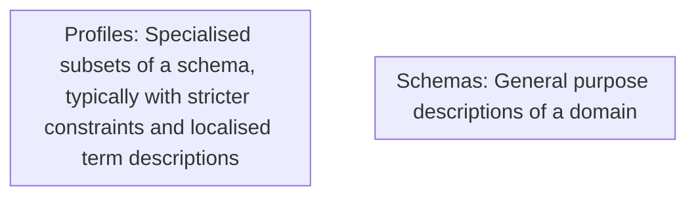
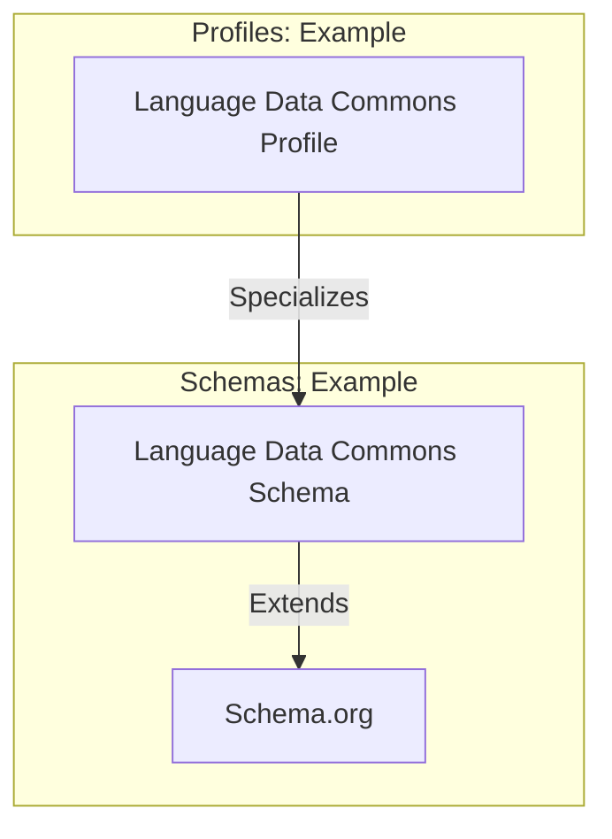
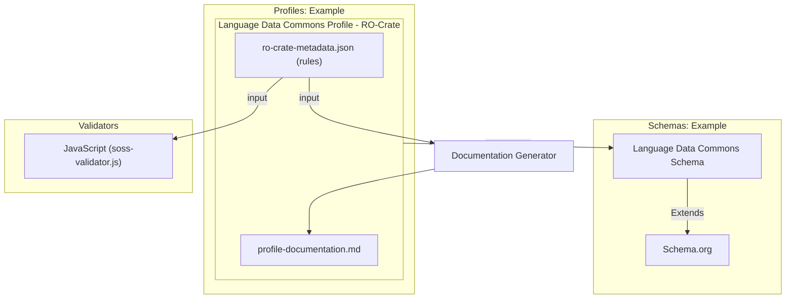

# RO-Crate Machine Actionable Schemas and Profiles (MASP)

This profile describes the structure of an RO-Crate MASP **Profile Crate** — a crate that contains machine-readable validation rules for other RO-Crates. It is used both as documentation and as input to the MASP validator and documentation generator. This profile is self-describing: the MASP profile crate is itself a valid instance of this profile.

## Background

### Definitions

| Term | Definition |
|------|------------|
| **General Purpose Schema** | A specification of Classes and Properties intended for use across multiple profiles (e.g. Schema.org, Dublin Core, Darwin Core). These may have loose range/domain constraints, typically with inheritance (a `Person` is a subclass of `Thing`). |
| **Schema Language** | The formalisation used to express a schema. Examples include RDF Schema (RDFS), OWL, SKOS, and Schema.org's own data model. |
| **SoSS (Schema.org Style Schema)** | Schema.org's data model expressed as a set of `rdfs:Class` and `rdf:Property` definitions in JSON-LD. RO-Crate 1.2 uses this approach for adding extra vocabulary terms to crates and profiles. |
| **Profile Specific Schema** | A schema specialised for a particular domain. For example, the Language Data Commons has a general-purpose SoSS at `http://w3id.org/ldac/terms` and a stricter profile at `https://w3id.org/ldac/profile`. |
| **Class** | A named type applied to entities via the `@type` property. MASP uses `rdfs:Class` as per Schema.org's data model. |
| **Property** | An attribute of an entity. MASP uses `rdf:Property` as per Schema.org's data model. |
| **Profile** | A specialisation of a standard or specification, as defined by the [W3C Profiles Vocabulary](https://www.w3.org/TR/dx-prof/). A profile introduces constraints or extensions that make a standard suitable for a particular purpose. Profile Crates are profiles of RO-Crate. |
| **Profile Crate** | An RO-Crate whose root entity has `@type: ["Dataset", "Profile"]` and contains machine-readable schema rules alongside human-readable documentation. The structure is defined in the [RO-Crate 1.2 Profiles specification](https://www.researchobject.org/ro-crate/specification/1.2/profiles.html). |

The relationship between schemas and profiles:



An example with real vocabularies:



Both schemas and profiles can be expressed in RO-Crate MASP:



### Background: Schema.org Style Schemas

Schema.org describes its vocabulary using `rdf:Property` and `rdfs:Class` entities. RO-Crate has used this convention since its inception. For example, the Schema.org definition of `author`:

```json
{
  "@id": "schema:author",
  "@type": "rdf:Property",
  "rdfs:comment": "The author of this content.",
  "rdfs:label": "author",
  "schema:domainIncludes": [
    {"@id": "schema:CreativeWork"}
  ],
  "schema:rangeIncludes": [
    {"@id": "schema:Organization"},
    {"@id": "schema:Person"}
  ]
}
```

MASP extends this approach with a few additions — `prov:specializationOf` to link a profile-specific class or property to its base vocabulary term, and `sh:minCount`/`sh:maxCount` borrowed from SHACL to express cardinality.

## Profile Specific Schemas

A MASP profile-specific schema specializes Schema.org-style terms for a particular context. The key differences from plain Schema.org style:

- `prov:specializationOf` links the local rule to the base vocabulary term it constrains
- `domainIncludes` (without `schema:` prefix — the validator resolves this via the RO-Crate JSON-LD context) links a property rule to its class rule
- `sh:minCount` and `sh:maxCount` express how many times a property must appear

Example class and property rules for a hypothetical scholarly profile:

```json
{
  "@id": "#class_ScholarlyArticle",
  "@type": "rdfs:Class",
  "prov:specializationOf": {"@id": "https://schema.org/ScholarlyArticle"},
  "rdfs:label": "ScholarlyArticle",
  "rdfs:comment": "A scholarly article in this profile's context.",
  "sh:minCount": 1,
  "sh:maxCount": 1
},
{
  "@id": "#prop_author_ScholarlyArticle",
  "@type": "rdf:Property",
  "prov:specializationOf": {"@id": "https://schema.org/author"},
  "rdfs:label": "author",
  "rdfs:comment": "The author(s) of this scholarly article.",
  "domainIncludes": {"@id": "#class_ScholarlyArticle"},
  "rangeIncludes": {"@id": "#class_Person"},
  "sh:minCount": 1
}
```

**Important**: use `domainIncludes` (not `schema:domainIncludes`) — the validator resolves property names through the RO-Crate JSON-LD context, where the `schema:` prefix is not defined by default.

### Linking the Metadata Descriptor

Every MASP profile must define how to find the root class rule. This is done via a special property rule whose `rdfs:label` is `"@id"` and whose `value` is `"ro-crate-metadata.json"`. The validator detects this pattern to identify which class rule is the Metadata Descriptor — and from there, follows `about` to find the Root Data Entity class:

```json
{
  "@id": "#class_MetadataDescriptor",
  "@type": "rdfs:Class",
  "prov:specializationOf": {"@id": "http://schema.org/CreativeWork"},
  "sh:minCount": 1,
  "sh:maxCount": 1
},
{
  "@id": "#prop_id_MetadataDescriptor",
  "@type": "rdf:Property",
  "rdfs:label": "@id",
  "value": "ro-crate-metadata.json",
  "domainIncludes": {"@id": "#class_MetadataDescriptor"},
  "sh:minCount": 1,
  "sh:maxCount": 1
},
{
  "@id": "#prop_about_MetadataDescriptor",
  "@type": "rdf:Property",
  "prov:specializationOf": {"@id": "http://schema.org/about"},
  "rdfs:label": "about",
  "domainIncludes": {"@id": "#class_MetadataDescriptor"},
  "rangeIncludes": {"@id": "#class_RootDataEntity"},
  "sh:minCount": 1,
  "sh:maxCount": 1
}
```

The validator uses the `#prop_id_MetadataDescriptor` pattern (`rdfs:label: "@id"` + `value: "ro-crate-metadata.json"`) to locate the root class rule at parse time.

### How the Validator Finds Schema Rules

The validator locates schema rules by inspecting the profile's `hasResource` array for a `ResourceDescriptor` entity with `hasRole` pointing to `http://www.w3.org/ns/dx/prof/role/schema`. The `hasPart` array of that descriptor lists all the schema entities (`rdfs:Class`, `rdf:Property`, `ItemList`, `DefinedTermSet`):

```json
{
  "@id": "#hasSpecializedSchema",
  "@type": "ResourceDescriptor",
  "hasRole": {"@id": "http://www.w3.org/ns/dx/prof/role/schema"},
  "hasPart": [
    {"@id": "#class_MetadataDescriptor"},
    {"@id": "#prop_id_MetadataDescriptor"},
    {"@id": "#prop_about_MetadataDescriptor"},
    ...
  ]
}
```

Only entities listed here are treated as validation rules. Other entities in the crate (documentation files, authors, etc.) are ignored by the validator.

## Validation Algorithm

The validator (`soss-validator.js`) works as follows:

1. **Find the schema ResourceDescriptor** — locate the `ResourceDescriptor` with `role/schema` in `hasResource` and read its `hasPart` list.

2. **Parse rules** — for each entity in `hasPart`:
   - `rdfs:Class` → `ClassRule` (type matching + cardinality)
   - `rdf:Property` → `PropertyRule` (presence, cardinality, range, fixed value)
   - `ItemList` → `ItemListRule` (enumerated allowed values)
   - `DefinedTermSet` → `TermRule` (term documentation; currently pass-through)

3. **Detect root class rule** — the property rule with `rdfs:label: "@id"` and `value: "ro-crate-metadata.json"` identifies the Metadata Descriptor class rule. This sets the starting point for validation.

4. **Validate the target crate** — for each class rule, iterate all entities in the target crate:
   - Resolve the entity's `@type` values through the target crate's JSON-LD context
   - Compare against the class rule's `prov:specializationOf` resolved types
   - If the types match, validate all property rules linked to that class via `domainIncludes`
   - Count valid instances and check against `sh:minCount`/`sh:maxCount`

5. **Property rule validation** — for each matching entity:
   - If the property has a `value` constraint, check for exact match
   - Otherwise check cardinality (`sh:minCount`, `sh:maxCount`)
   - If `rangeIncludes` is set, validate each value: primitive types (Text, Number, Boolean, Date) are checked by JS type; entity references are looked up in the crate and validated recursively against the referenced class rule; `ItemList` values are checked against the list's `itemListElement` entries

6. **Results** — the validator returns `{ error, success, rules }` where `rules` contains per-entity property success/error details keyed by rule ID and entity ID.

### Cardinality on Classes vs Properties

`sh:minCount`/`sh:maxCount` mean different things depending on where they appear:

| Location | Meaning |
|----------|---------|
| On an `rdfs:Class` entity | How many instances of this type must exist in the whole crate |
| On an `rdf:Property` entity | How many values this property must/may have on each matching entity |

### Fixed-Value Properties

A property rule with a `value` field asserts that the property must have exactly that value. This is most commonly used for the metadata descriptor's `@id`, which must always be `"ro-crate-metadata.json"`. It is also used for entities like fixed dataset directory identifiers (e.g. `"@id": "examples/"`).

### ItemList Validation

When a property's `rangeIncludes` references an `ItemList` entity, the value must match one of the `itemListElement` entries by `@id`. Item elements can include additional properties that must also match, allowing for constrained contextual entity definitions within a profile.

${rules.all}

${rules.allItemLists}
